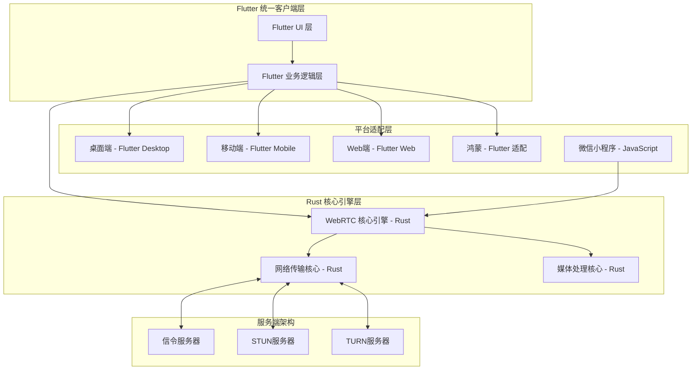
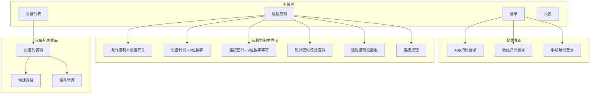
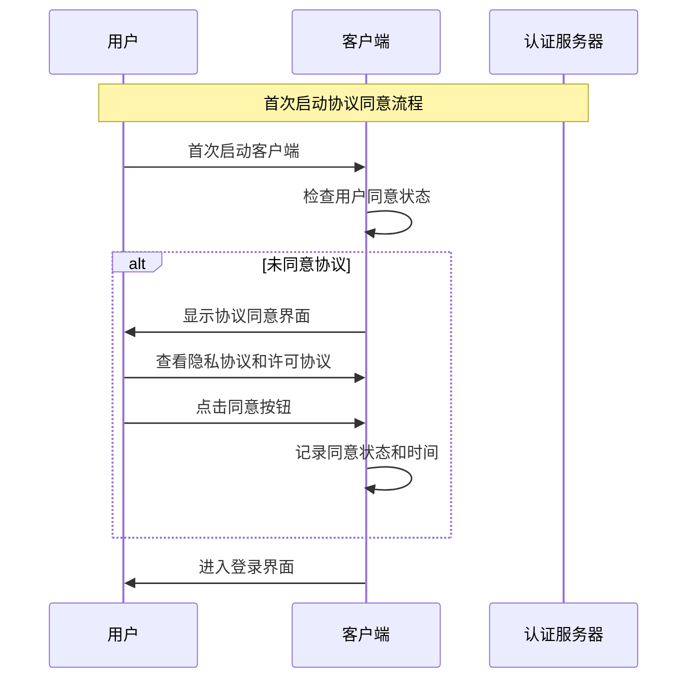
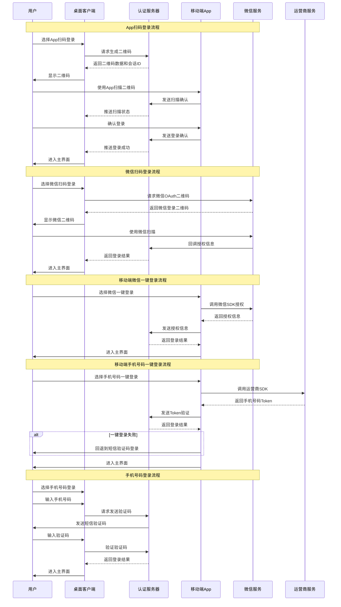
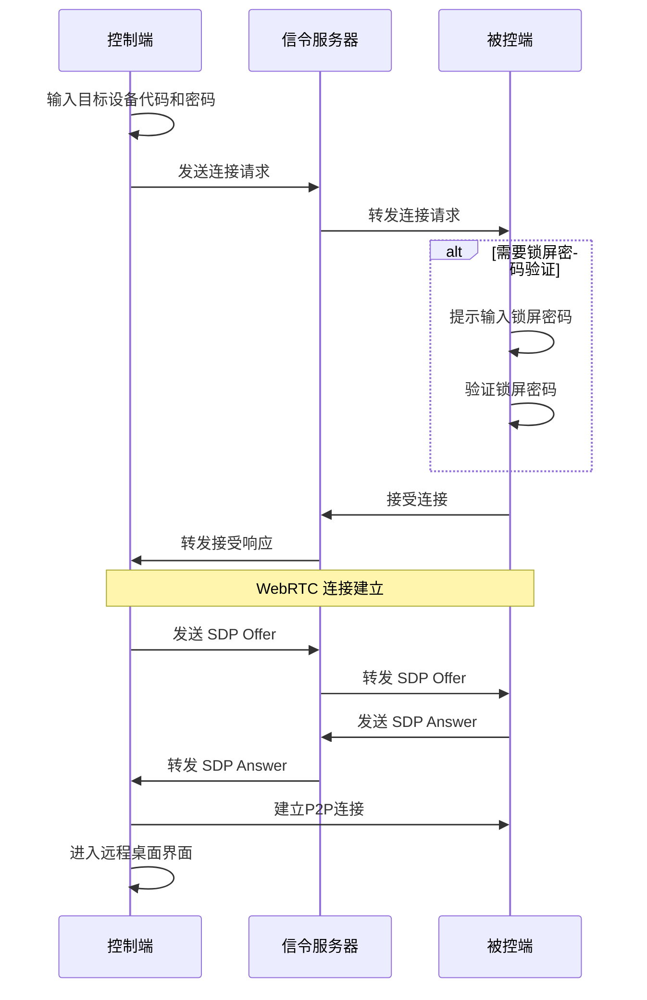

# 设计文档 - 工一远程客户端

## 概述

工一远程客户端是一个基于现代 WebRTC 技术的远程控制解决方案，采用点对点架构实现低延迟、高质量的远程桌面体验。系统支持多平台部署（Windows、macOS、Linux、iOS、Android、鸿蒙、Web、微信小程序），通过模块化设计实现代码复用和平台特定优化。

### 核心特性

- **WebRTC 点对点传输**: 利用现代 WebRTC 技术实现低延迟音视频传输
- **跨平台支持**: 统一的核心逻辑，平台特定的 UI 适配
- **智能网络适配**: 自动 NAT 穿透、TURN 中继回退、自适应码率调整
- **安全加密**: 端到端加密保护所有数据传输
- **实时监控**: 网络质量监控和性能指标显示

## 架构设计

### 整体架构

系统采用分层架构设计，使用 Rust + Flutter 的混合架构：



### 技术栈选择

基于维护复杂度和开发效率考虑，推荐简化的技术栈：

**核心 WebRTC 引擎**: Rust
- 高性能、内存安全的 WebRTC 核心实现
- 跨平台编译，可被其他语言调用
- 处理音视频编解码、网络传输等核心逻辑

**统一客户端框架**: Flutter
- **桌面端**（Windows、macOS、Linux）：Flutter Desktop
- **移动端**（iOS、Android）：Flutter 原生支持
- **Web 端**：Flutter Web（编译为 JavaScript）
- **鸿蒙系统**：使用第三方 Flutter 鸿蒙适配方案
- 优势：单一代码库、统一 UI/UX、丰富的 WebRTC 插件生态

**微信小程序**: JavaScript
- 必须使用微信小程序原生技术栈
- 利用小程序的 WebRTC API 和画布组件
- 通过 FFI 调用 Rust 核心引擎（如果小程序支持）

### 技术栈优势

1. **维护简化**：从 5 种技术栈减少到 3 种
2. **代码复用**：Flutter 统一 80% 的客户端代码
3. **性能保证**：Rust 核心引擎确保关键路径性能
4. **开发效率**：单一 Flutter 代码库覆盖多平台
5. **生态支持**：Flutter 有成熟的 WebRTC 插件

## 组件和接口

### 核心组件

#### 1. WebRTC 引擎 (WebRTCEngine)

负责 WebRTC 连接管理和媒体传输（Rust 核心 + Dart 绑定）：

```dart
// Flutter/Dart 接口，调用 Rust 核心
abstract class WebRTCEngine {
  // 连接管理
  Future<RTCPeerConnection> createPeerConnection(RTCConfiguration config);
  Future<void> establishConnection(String remoteId);
  Future<void> closeConnection();
  
  // 媒体流管理
  Future<MediaStream> startScreenCapture(Map<String, dynamic> constraints);
  Future<MediaStream> startAudioCapture();
  Future<void> addLocalStream(MediaStream stream);
  
  // 数据通道
  RTCDataChannel createDataChannel(String label);
  Future<void> sendData(Uint8List data);
  
  // 事件回调
  Stream<RTCPeerConnectionState> get onConnectionStateChange;
  Stream<Uint8List> get onDataReceived;
  Stream<MediaStream> get onRemoteStream;
}
```

#### 2. 信令客户端 (SignalingClient)

处理设备发现和连接协商：

```dart
abstract class SignalingClient {
  // 连接管理
  Future<void> connect(String serverUrl);
  Future<void> disconnect();
  
  // 设备管理
  Future<String> registerDevice(DeviceInfo deviceInfo); // 返回 Device_ID
  Future<DeviceStatus> queryDeviceStatus(String deviceId);
  
  // 信令交换
  Future<void> sendOffer(String targetId, RTCSessionDescription offer);
  Future<void> sendAnswer(String targetId, RTCSessionDescription answer);
  Future<void> sendIceCandidate(String targetId, RTCIceCandidate candidate);
  
  // 事件回调
  Stream<OfferEvent> get onOfferReceived;
  Stream<AnswerEvent> get onAnswerReceived;
  Stream<IceCandidateEvent> get onIceCandidateReceived;
  Stream<ConnectionRequestEvent> get onConnectionRequest;
}
```

#### 3. 屏幕捕获器 (ScreenCapturer)

处理屏幕内容捕获和编码：

```typescript
interface ScreenCapturer {
  // 屏幕捕获
  getAvailableDisplays(): Promise<DisplayInfo[]>
  startCapture(displayId: string, options: CaptureOptions): Promise<MediaStream>
  stopCapture(): void
  
  // 编码设置
  setVideoCodec(codec: VideoCodec): void
  setFrameRate(fps: number): void
  setResolution(width: number, height: number): void
  
  // 硬件加速
  isHardwareAccelerationAvailable(): boolean
  enableHardwareAcceleration(enable: boolean): void
  
  // 事件回调
  onFrameCaptured: (frame: VideoFrame) => void
  onCaptureError: (error: Error) => void
}
```

#### 4. 输入控制器 (InputController)

处理远程输入事件：

```typescript
interface InputController {
  // 鼠标控制
  sendMouseMove(x: number, y: number): void
  sendMouseClick(button: MouseButton, x: number, y: number): void
  sendMouseWheel(deltaX: number, deltaY: number): void
  
  // 键盘控制
  sendKeyDown(key: string, modifiers: KeyModifiers): void
  sendKeyUp(key: string, modifiers: KeyModifiers): void
  sendKeyPress(key: string, modifiers: KeyModifiers): void
  
  // 输入处理
  processRemoteInput(inputEvent: InputEvent): void
  setInputDelay(maxDelay: number): void // 设置最大延迟阈值
  
  // 键盘布局
  setKeyboardLayout(layout: KeyboardLayout): void
  detectKeyboardLayout(): KeyboardLayout
}
```

#### 5. 文件传输器 (FileTransfer)

处理文件传输功能：

```typescript
interface FileTransfer {
  // 文件传输
  sendFile(filePath: string, targetId: string): Promise<TransferResult>
  receiveFile(transferId: string, savePath: string): Promise<TransferResult>
  
  // 传输控制
  pauseTransfer(transferId: string): void
  resumeTransfer(transferId: string): void
  cancelTransfer(transferId: string): void
  
  // 断点续传
  getTransferProgress(transferId: string): TransferProgress
  resumeFromBreakpoint(transferId: string): Promise<void>
  
  // 事件回调
  onTransferProgress: (transferId: string, progress: TransferProgress) => void
  onTransferComplete: (transferId: string, result: TransferResult) => void
  onTransferError: (transferId: string, error: Error) => void
}
```

#### 6. 认证服务 (AuthenticationService)

处理多种登录认证方式：

```dart
// Flutter/Dart 认证服务接口
abstract class AuthenticationService {
  // App 扫码登录
  Future<QRCodeSession> generateQRCode();
  Stream<QRCodeStatus> watchQRCodeStatus(String sessionId);
  Future<LoginResult> confirmQRCodeLogin(String sessionId, String userId);
  
  // 微信扫码登录
  Future<WeChatQRCode> generateWeChatQRCode();
  Future<LoginResult> handleWeChatCallback(String code);
  
  // 手机号码登录
  Future<void> sendSMSVerificationCode(String phoneNumber);
  Future<LoginResult> verifySMSCode(String phoneNumber, String code);
  
  // 会话管理
  Future<LoginSession> getCurrentSession();
  Future<void> refreshSession();
  Future<void> logout();
  
  // 安全存储
  Future<void> saveCredentials(LoginCredentials credentials);
  Future<LoginCredentials?> loadCredentials();
  Future<void> clearCredentials();
  
  // 事件回调
  Stream<AuthenticationState> get onAuthStateChange;
  
  // 移动端一键登录
  Future<LoginResult> wechatOneClickLogin(); // 微信一键登录
  Future<LoginResult> carrierOneClickLogin(); // 运营商一键登录
  
  // 协议同意管理
  Future<bool> hasUserConsent();
  Future<void> recordUserConsent(ConsentInfo consent);
  Future<ConsentInfo?> getConsentInfo();
  Future<bool> needsConsentUpdate(String currentVersion);
}

// 用户同意信息
class ConsentInfo {
  final bool privacyPolicyAccepted;
  final bool licenseAgreementAccepted;
  final DateTime consentTime;
  final String privacyPolicyVersion;
  final String licenseAgreementVersion;
}

// 二维码会话
class QRCodeSession {
  final String sessionId;
  final String qrCodeData;
  final DateTime expiresAt;
  final QRCodeStatus status;
}

// 登录结果
class LoginResult {
  final bool success;
  final String? userId;
  final String? accessToken;
  final String? refreshToken;
  final String? errorMessage;
}

// 登录凭证
class LoginCredentials {
  final String userId;
  final String accessToken;
  final String refreshToken;
  final DateTime expiresAt;
  final LoginMethod method;
}

enum LoginMethod {
  appQRCode,
  wechatQRCode,
  phoneNumber,
}
```

#### 7. 设备管理服务 (DeviceManagementService)

管理设备列表和设备信息：

```dart
abstract class DeviceManagementService {
  // 设备代码和密码
  Future<String> generateDeviceCode(); // 生成9位数字设备代码
  Future<String> generateConnectionPassword(); // 生成9位数字字符组合密码
  Future<void> refreshConnectionPassword();
  
  // 设备列表管理
  Future<List<DeviceRecord>> getDeviceList();
  Future<void> addDevice(DeviceRecord device);
  Future<void> removeDevice(String deviceId);
  Future<void> renameDevice(String deviceId, String newName);
  
  // 设备状态
  Future<DeviceStatus> getDeviceStatus(String deviceId);
  Stream<DeviceStatus> watchDeviceStatus(String deviceId);
  
  // 本设备控制
  Future<void> setAllowRemoteControl(bool allow);
  Future<bool> getAllowRemoteControl();
  Future<void> setRequireScreenLockPassword(bool require);
  Future<bool> getRequireScreenLockPassword();
  
  // 锁屏密码验证
  Future<bool> verifyScreenLockPassword(String password);
}

// 设备记录
class DeviceRecord {
  final String deviceId;
  final String deviceCode;
  String displayName;
  final String platform;
  final DateTime lastOnlineTime;
  final bool isOnline;
}

// 设备状态
class DeviceStatus {
  final String deviceId;
  final bool isOnline;
  final bool allowRemoteControl;
  final DateTime lastSeen;
}
```

#### 8. 会话管理器 (SessionManager)

管理远程控制会话：

```typescript
interface SessionManager {
  // 会话控制
  createSession(remoteId: string, options: SessionOptions): Promise<Session>
  joinSession(sessionId: string): Promise<Session>
  endSession(sessionId: string): void
  
  // 会话查询
  getActiveSessions(): Session[]
  getSessionHistory(days: number): SessionRecord[]
  getSessionStats(sessionId: string): SessionStats
  
  // 权限管理
  requestPermission(remoteId: string, permissions: Permission[]): Promise<boolean>
  grantPermission(requestId: string, grant: boolean): void
  
  // 事件回调
  onSessionStarted: (session: Session) => void
  onSessionEnded: (session: Session, reason: string) => void
  onPermissionRequest: (request: PermissionRequest) => void
}
```

### 平台抽象接口

#### 平台服务接口 (PlatformService)

```typescript
interface PlatformService {
  // 系统信息
  getSystemInfo(): SystemInfo
  getDisplayInfo(): DisplayInfo[]
  
  // 文件系统
  selectFile(options: FileSelectOptions): Promise<string>
  saveFile(data: ArrayBuffer, filename: string): Promise<string>
  
  // 通知
  showNotification(title: string, message: string): void
  showDialog(options: DialogOptions): Promise<DialogResult>
  
  // 系统集成
  setAutoStart(enable: boolean): void
  minimizeToTray(): void
  bringToFront(): void
}
```

#### 微信小程序适配接口 (WeChatMiniProgramAdapter)

```typescript
interface WeChatMiniProgramAdapter {
  // 小程序生命周期
  onLaunch(options: LaunchOptions): void
  onShow(options: ShowOptions): void
  onHide(): void
  
  // 画布渲染
  createCanvasContext(canvasId: string): CanvasContext
  drawVideoFrame(context: CanvasContext, frame: VideoFrame): void
  
  // 触摸事件处理
  onTouchStart(event: TouchEvent): InputEvent
  onTouchMove(event: TouchEvent): InputEvent
  onTouchEnd(event: TouchEvent): InputEvent
  
  // 文件系统
  chooseFile(options: ChooseFileOptions): Promise<FileInfo>
  saveToAlbum(filePath: string): Promise<void>
  
  // 权限管理
  requestPermission(scope: string): Promise<boolean>
  checkPermission(scope: string): Promise<PermissionStatus>
  
  // 内存优化
  getMemoryInfo(): MemoryInfo
  optimizeMemoryUsage(): void
  
  // 分享功能
  shareToChat(options: ShareOptions): Promise<void>
  onShareAppMessage(): ShareInfo
}
```

#### 鸿蒙系统适配接口 (HarmonyOSAdapter)

```dart
// Flutter 鸿蒙适配接口
abstract class HarmonyOSAdapter {
  // 鸿蒙系统信息
  Future<HarmonyDeviceInfo> getDeviceInfo();
  Future<SystemCapabilities> getSystemCapabilities();
  
  // 分布式能力（通过第三方插件或平台通道）
  Future<List<DistributedDevice>> getDistributedDevices();
  Future<void> startDeviceDiscovery();
  Future<void> connectToDevice(String deviceId);
  
  // 跨设备协同
  Future<void> migrateSession(String targetDeviceId);
  Future<void> continueOnDevice(String deviceId, Map<String, dynamic> sessionData);
  
  // 多窗口支持（Flutter 窗口管理）
  Future<void> createSubWindow(WindowOptions options);
  Future<void> enterSplitScreenMode();
  Future<void> exitSplitScreenMode();
  
  // 资源管理
  void onMemoryLevel(MemoryLevel level);
  void onThermalLevel(ThermalLevel level);
  
  // 系统集成（通过平台通道）
  Future<void> addToRecentTasks(TaskInfo taskInfo);
  Future<void> setStatusBarColor(String color);
  Future<void> enableImmersiveMode(bool enable);
  
  // 文件管理器集成
  Future<void> openWithFileManager(String filePath);
  Future<void> shareWithSystemShare(FileInfo fileInfo);
}
```

## 数据模型

### UI 架构设计

#### 客户端主菜单结构



#### 登录流程设计





#### 远程控制连接流程



### 核心数据结构

```typescript
// 设备信息
interface DeviceInfo {
  deviceId: string
  deviceName: string
  platform: Platform // 现在包括 WeChat_MiniProgram 和 HarmonyOS
  version: string
  capabilities: DeviceCapabilities
  lastSeen: Date
}

// 会话信息
interface Session {
  sessionId: string
  controllerId: string
  controlledId: string
  startTime: Date
  endTime?: Date
  status: SessionStatus
  permissions: Permission[]
  stats: SessionStats
}

// 网络统计
interface NetworkStats {
  rtt: number // 往返时间 (ms)
  packetLoss: number // 丢包率 (%)
  jitter: number // 抖动 (ms)
  bandwidth: number // 带宽 (kbps)
  connectionType: ConnectionType // 连接类型
}

// 传输进度
interface TransferProgress {
  transferId: string
  filename: string
  totalSize: number
  transferredSize: number
  speed: number // bytes/s
  estimatedTime: number // 剩余时间 (s)
  status: TransferStatus
}

// 微信小程序特定数据
interface WeChatMiniProgramInfo {
  appId: string
  version: string
  scene: number // 小程序场景值
  memoryLimit: number // 内存限制 (MB)
  canvasSupport: boolean
  webrtcSupport: boolean
}

// 鸿蒙系统特定数据
interface HarmonyOSInfo {
  harmonyVersion: string
  apiLevel: number
  distributedCapability: boolean
  multiWindowSupport: boolean
  deviceType: HarmonyDeviceType // 手机、平板、智慧屏等
  cooperationDevices: DistributedDevice[] // 可协同设备列表
}

// 登录会话数据
interface LoginSession {
  userId: string
  accessToken: string
  refreshToken: string
  expiresAt: Date
  loginMethod: LoginMethod
  deviceId: string
}

// 二维码状态
enum QRCodeStatus {
  Pending = "pending",       // 等待扫描
  Scanned = "scanned",       // 已扫描，等待确认
  Confirmed = "confirmed",   // 已确认
  Expired = "expired",       // 已过期
  Cancelled = "cancelled"    // 已取消
}

// 登录方式
enum LoginMethod {
  AppQRCode = "app_qrcode",
  WeChatQRCode = "wechat_qrcode",
  PhoneNumber = "phone_number"
}

// 设备记录
interface DeviceRecord {
  deviceId: string
  deviceCode: string          // 9位数字设备代码
  displayName: string
  platform: Platform
  lastOnlineTime: Date
  isOnline: boolean
}

// 远程控制设置
interface RemoteControlSettings {
  allowRemoteControl: boolean
  deviceCode: string          // 9位数字
  connectionPassword: string  // 9位数字字符组合
  requireScreenLockPassword: boolean
}

// 平台枚举扩展
enum Platform {
  Windows = "windows",
  MacOS = "macos", 
  Linux = "linux",
  iOS = "ios",
  Android = "android",
  HarmonyOS = "harmonyos",
  Web = "web",
  WeChatMiniProgram = "wechat_miniprogram"
}
```

## 正确性属性

*属性是一个特征或行为，应该在系统的所有有效执行中保持为真——本质上是关于系统应该做什么的正式声明。属性作为人类可读规范和机器可验证正确性保证之间的桥梁。*

基于需求分析，以下是系统必须满足的正确性属性：

### 属性 1: 跨平台功能一致性
*对于任何*支持的平台，当用户使用客户端时，应该提供统一的用户体验和操作流程
**验证: 需求 1.7**

### 属性 2: WebRTC 协议使用
*对于任何*远程桌面连接建立，系统应该使用 WebRTC 协议传输音视频数据
**验证: 需求 2.1**

### 属性 3: 自适应码率调整
*对于任何*网络带宽波动情况，WebRTC 引擎应该自动调整码率以适应当前网络条件
**验证: 需求 2.4**

### 属性 4: 网络协议回退机制
*对于任何*IPv6 连接失败的情况，系统应该自动回退到 IPv4 连接
**验证: 需求 3.3**

### 属性 5: 信令交换性能
*对于任何*信令交换过程，信令服务器应该在 5 秒内完成信令交换
**验证: 需求 4.5**

### 属性 6: 设备 ID 唯一性
*对于任何*设备首次注册，系统应该为该设备生成唯一的 Device_ID
**验证: 需求 5.1**

### 属性 7: 访问码过期机制
*对于任何*生成的 Access_Code，系统应该在 10 分钟后使该访问码自动过期
**验证: 需求 5.7**

### 属性 8: 屏幕传输帧率
*对于任何*屏幕内容传输，系统应该以 30-60 FPS 的帧率进行传输
**验证: 需求 6.3**

### 属性 9: 输入响应延迟
*对于任何*控制端发送的鼠标事件，被控端应该在 100ms 内执行相应操作
**验证: 需求 7.1**

### 属性 10: 断点续传功能
*对于任何*文件传输中断情况，系统应该支持断点续传功能
**验证: 需求 8.5**

### 属性 11: 媒体流加密
*对于任何*媒体流传输，系统应该使用 DTLS-SRTP 加密所有 WebRTC 媒体流
**验证: 需求 10.1**

### 属性 12: 网络质量警告
*对于任何*网络质量下降情况，系统应该在用户界面显示质量警告
**验证: 需求 11.6**

### 属性 13: 连接事件日志
*对于任何*连接建立或断开事件，系统应该记录连接事件和相关信息
**验证: 需求 14.1**

### 属性 14: 微信小程序 WebRTC API 使用
*对于任何*微信小程序中的远程连接建立，系统应该使用微信小程序的 WebRTC API 建立连接
**验证: 需求 15.2**

### 属性 15: 微信小程序画布显示
*对于任何*微信小程序中的远程桌面显示，系统应该适配小程序的画布组件进行屏幕显示
**验证: 需求 15.3**

### 属性 16: 微信小程序触摸输入转换
*对于任何*微信小程序中的输入操作，系统应该通过触摸事件模拟鼠标和键盘操作
**验证: 需求 15.4**

### 属性 17: 微信小程序文件系统 API 使用
*对于任何*微信小程序中的文件传输，系统应该使用微信小程序的文件系统 API 进行文件操作
**验证: 需求 15.5**

### 属性 18: 鸿蒙系统原生 UI 框架使用
*对于任何*鸿蒙系统中的 UI 组件，系统应该使用鸿蒙系统的原生 UI 框架
**验证: 需求 16.1**

### 属性 19: 鸿蒙系统 API 使用
*对于任何*鸿蒙系统中的远程连接建立，系统应该使用鸿蒙系统的网络和媒体 API
**验证: 需求 16.2**

### 属性 20: 鸿蒙系统多窗口支持
*对于任何*鸿蒙系统中的远程桌面显示，系统应该支持鸿蒙系统的多窗口和分屏功能
**验证: 需求 16.3**

### 属性 21: 鸿蒙系统手势输入支持
*对于任何*鸿蒙系统中的输入操作，系统应该支持鸿蒙系统的手势导航和输入方式
**验证: 需求 16.4**

### 属性 22: 鸿蒙系统文件管理器集成
*对于任何*鸿蒙系统中的文件传输，系统应该集成鸿蒙系统的文件管理器和分享功能
**验证: 需求 16.5**

### 属性 23: 鸿蒙系统后台任务规范
*对于任何*鸿蒙系统中的后台运行，系统应该遵循鸿蒙系统的后台任务管理规范
**验证: 需求 16.6**

### 属性 24: 鸿蒙系统分布式能力支持
*对于任何*具有分布式能力的鸿蒙系统，系统应该支持跨设备协同和流转功能
**验证: 需求 16.7**

### 属性 25: 二维码会话信息完整性
*对于任何*生成的 App 扫码登录二维码，二维码数据应该包含有效的会话 ID 和过期时间信息
**验证: 需求 17.1**

### 属性 26: 二维码过期机制
*对于任何*生成的二维码（App 扫码或微信扫码），系统应该在 5 分钟后使该二维码过期
**验证: 需求 17.5**

### 属性 27: 短信验证码过期机制
*对于任何*发送的短信验证码，系统应该在 5 分钟后使该验证码过期
**验证: 需求 17.15**

### 属性 28: 验证码错误锁定机制
*对于任何*手机号码，当验证码输入错误超过 5 次时，系统应该锁定该手机号码 30 分钟
**验证: 需求 17.14**

### 属性 29: 登录会话创建和存储
*对于任何*成功的登录操作，系统应该创建 Login_Session 并使用平台安全存储机制存储登录凭证
**验证: 需求 17.16, 18.2**

### 属性 30: 登出会话清除
*对于任何*用户登出操作，系统应该清除本地 Login_Session 和所有登录凭证
**验证: 需求 17.18**

### 属性 31: 登录凭证传输加密
*对于任何*登录凭证传输，系统应该使用 TLS 1.3 加密所有登录相关通信
**验证: 需求 18.1**

### 属性 32: 会话令牌定期刷新
*对于任何*有效的 Login_Session，系统应该定期刷新会话令牌以保持安全性
**验证: 需求 18.5**

### 属性 33: 会话过期机制
*对于任何* Login_Session，当超过 30 天未活动时，系统应该使该会话过期
**验证: 需求 18.6**

### 属性 34: 账户锁定机制
*对于任何*用户账户，当连续登录失败 10 次时，系统应该临时锁定该账户
**验证: 需求 18.7**

### 属性 35: 未登录访问控制
*对于任何*未登录状态的用户，当访问远程控制或设备列表功能时，系统应该引导用户先完成登录
**验证: 需求 19.2**

### 属性 36: 远程控制开关拒绝连接
*对于任何*"允许控制本设备"开关关闭的设备，系统应该拒绝所有远程连接请求
**验证: 需求 20.2**

### 属性 37: 设备代码格式
*对于任何*生成的设备代码，应该是 9 位数字格式
**验证: 需求 20.3**

### 属性 38: 连接密码格式
*对于任何*生成的连接密码，应该是 9 位数字字符组合格式
**验证: 需求 20.4**

### 属性 39: 连接密码刷新
*对于任何*连接密码刷新操作，系统应该生成新的不同于旧密码的连接密码
**验证: 需求 20.5**

### 属性 40: 锁屏密码验证
*对于任何*启用了锁屏密码校验的设备，在接受远程连接前应该要求输入正确的锁屏密码
**验证: 需求 20.7**

### 属性 41: 设备列表持久化
*对于任何*新设备首次连接成功，系统应该自动将该设备添加到设备列表
**验证: 需求 21.10**

### 属性 42: 设备删除
*对于任何*设备删除操作，系统应该从设备列表中移除该设备记录
**验证: 需求 21.8**

### 属性 43: 移动端微信一键登录
*对于任何*移动端微信一键登录操作，系统应该调用微信 SDK 获取用户授权并完成登录
**验证: 需求 17a.1, 17a.2**

### 属性 44: 移动端运营商一键登录回退
*对于任何*运营商一键登录失败的情况，系统应该自动回退到短信验证码登录方式
**验证: 需求 17a.6**

### 属性 45: 首次启动协议同意
*对于任何*首次启动客户端的用户，系统应该显示用户隐私协议和软件许可协议同意界面
**验证: 需求 17b.1**

### 属性 46: 未同意协议禁止使用
*对于任何*未同意协议的用户，系统应该禁止用户继续使用客户端功能
**验证: 需求 17b.4**

### 属性 47: 协议同意状态记录
*对于任何*用户同意协议的操作，系统应该记录用户同意状态和同意时间
**验证: 需求 17b.5**

### 属性 48: 协议更新重新同意
*对于任何*协议内容更新的情况，系统应该在用户下次启动时重新显示协议同意界面
**验证: 需求 17b.7**

## 错误处理

### 登录认证错误处理

1. **二维码扫码登录失败**
   - 二维码过期自动刷新提示
   - 扫码超时友好提示
   - 网络异常重试机制

2. **微信授权失败**
   - 用户取消授权提示
   - 微信服务异常提示
   - 重新授权引导

3. **手机号码登录失败**
   - 验证码发送失败重试
   - 验证码错误次数限制提示
   - 手机号码锁定提示

4. **会话管理错误**
   - 会话过期自动跳转登录
   - 令牌刷新失败处理
   - 多设备登录冲突处理

### 网络错误处理

1. **连接建立失败**
   - 自动重试机制（指数退避）
   - 多种连接方式尝试（STUN → TURN）
   - 用户友好的错误提示

2. **网络中断恢复**
   - 自动重连机制
   - 会话状态保持
   - 断点续传支持

3. **信令服务器故障**
   - 多服务器负载均衡
   - 自动故障转移
   - 本地状态缓存

### 媒体传输错误

1. **编解码器不支持**
   - 自动降级到兼容编解码器
   - 动态编解码器协商
   - 错误提示和建议

2. **帧率/质量下降**
   - 自适应质量调整
   - 网络状况监控
   - 用户手动质量控制

### 安全错误处理

1. **证书验证失败**
   - 连接立即终止
   - 安全警告显示
   - 用户确认机制

2. **加密失败**
   - 会话立即终止
   - 错误日志记录
   - 安全事件通知

## 测试策略

### 双重测试方法

系统采用单元测试和基于属性的测试相结合的方法：

**单元测试**:
- 验证具体示例和边界情况
- 测试组件集成点
- 验证错误条件处理

**基于属性的测试**:
- 验证通用属性在所有输入下成立
- 通过随机化实现全面的输入覆盖
- 每个属性测试最少运行 100 次迭代

### 测试配置

**属性测试库**: 
- JavaScript/TypeScript: fast-check
- Rust (Tauri 后端): proptest
- Dart (Flutter): test 包 + 自定义属性测试

**测试标记格式**:
每个属性测试必须使用以下标记格式引用设计文档属性：
```
Feature: cec-remote, Property {number}: {property_text}
```

### 关键测试场景

1. **跨平台兼容性测试**
   - 所有支持平台的功能验证（包括微信小程序和鸿蒙系统）
   - 平台间互操作性测试
   - UI 适配验证

2. **微信小程序特定测试**
   - 小程序环境下的 WebRTC 功能测试
   - 画布组件视频渲染测试
   - 触摸事件转换为鼠标/键盘操作测试
   - 内存限制下的性能优化测试
   - 权限申请和降级功能测试

3. **鸿蒙系统特定测试**
   - 鸿蒙原生 UI 框架集成测试
   - 多窗口和分屏功能测试
   - 手势导航和输入方式测试
   - 分布式能力和跨设备协同测试
   - 后台任务管理规范遵循测试

4. **网络环境测试**
   - 不同网络条件下的连接测试
   - NAT 穿透场景测试
   - 带宽限制下的质量调整测试

5. **性能测试**
   - 延迟测试（< 100ms 输入响应）
   - 帧率测试（30-60 FPS）
   - 信令交换时间测试（< 5s）

6. **安全测试**
   - 加密协议验证
   - 证书验证测试
   - 中间人攻击防护测试

7. **可靠性测试**
   - 长时间会话稳定性
   - 网络中断恢复测试
   - 文件传输断点续传测试

### 测试环境

- **本地测试**: 开发环境的基本功能测试
- **集成测试**: 多设备、多平台的集成测试环境
- **性能测试**: 模拟真实网络条件的性能测试环境
- **安全测试**: 专门的安全测试环境和工具