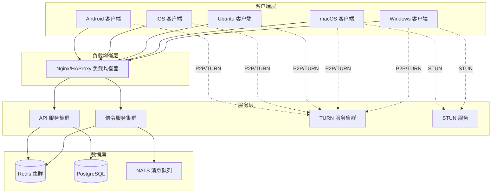

# 设计文档 - 远程桌面控制系统

## 概述

本系统是一个基于 WebRTC 的跨平台远程桌面控制解决方案，采用现代化的微服务架构和模块化设计。系统由客户端应用、信令服务、TURN/STUN 服务和后端 API 服务组成，支持 Windows、macOS、Ubuntu Desktop、iOS 和 Android 平台。

### 核心技术栈

- **WebRTC**: libwebrtc (Google 官方实现)，支持独立更新
- **信令协议**: WebSocket + Protocol Buffers
- **网络**: IPv4/IPv6 双栈，ICE/STUN/TURN
- **加密**: DTLS-SRTP (媒体流)，TLS 1.3 (信令)，AES-256-GCM (文件传输)
- **编解码器**: H.264/H.265/VP9 (视频)，Opus (音频)
- **后端**: Go (高性能、并发友好)
- **数据库**: PostgreSQL (用户数据)，Redis (会话状态、缓存)
- **消息队列**: NATS (异步任务处理)

## 架构

### 系统架构图



### 架构层次

系统采用分层架构设计，从下到上分为：

1. **平台抽象层**: 封装操作系统特定功能（屏幕捕获、输入注入、系统 API）
2. **核心业务层**: 跨平台共享的业务逻辑（连接管理、会话管理、协议处理）
3. **WebRTC 引擎层**: 独立的 WebRTC 封装，支持热更新
4. **网络传输层**: 信令通信、数据通道、媒体传输
5. **应用层**: 平台特定的 UI 和用户交互

## 组件和接口

### 1. 客户端架构

#### 1.1 跨平台核心模块 (C++)


使用 C++ 编写核心业务逻辑，通过 JNI (Android)、Objective-C++ (iOS/macOS) 和直接链接 (Windows/Linux) 实现跨平台复用。

**核心模块组成**:

```
CoreEngine/
├── connection/          # 连接管理
│   ├── ConnectionManager
│   ├── SessionManager
│   └── DeviceRegistry
├── webrtc/             # WebRTC 封装
│   ├── WebRTCEngine
│   ├── PeerConnectionWrapper
│   └── DataChannelManager
├── signaling/          # 信令客户端
│   ├── SignalingClient
│   └── ProtobufCodec
├── transport/          # 传输层
│   ├── FileTransfer
│   └── InputEventTransport
├── security/           # 安全模块
│   ├── Encryption
│   └── Authentication
└── platform/           # 平台抽象接口
    ├── IScreenCapture
    ├── IInputInjector
    └── ISystemInfo
```

**关键接口**:

```cpp
// 平台抽象接口
class IScreenCapture {
public:
    virtual ~IScreenCapture() = default;
    virtual std::vector<Display> GetDisplays() = 0;
    virtual FrameBuffer CaptureFrame(DisplayId id) = 0;
    virtual bool SupportsHardwareEncoding() = 0;
};

class IInputInjector {
public:
    virtual ~IInputInjector() = default;
    virtual void InjectMouseEvent(const MouseEvent& event) = 0;
    virtual void InjectKeyboardEvent(const KeyboardEvent& event) = 0;
};

// WebRTC 引擎接口
class IWebRTCEngine {
public:
    virtual ~IWebRTCEngine() = default;
    virtual void Initialize(const Config& config) = 0;
    virtual PeerConnection* CreatePeerConnection() = 0;
    virtual void SetVideoSource(VideoSource* source) = 0;
    virtual std::string GetVersion() = 0;
};
```

#### 1.2 平台特定实现

**Windows (C++/WinRT)**:
- 屏幕捕获: Windows.Graphics.Capture API (Windows 10+) 或 DXGI Desktop Duplication
- 输入注入: SendInput API
- UI: WPF 或 WinUI 3

**macOS (Objective-C++/Swift)**:
- 屏幕捕获: ScreenCaptureKit (macOS 12.3+) 或 CGDisplayStream
- 输入注入: CGEvent API
- UI: SwiftUI

**Ubuntu Desktop (C++/Qt)**:
- 屏幕捕获: X11 XDamage + XShm 或 PipeWire (Wayland)
- 输入注入: XTest extension 或 libinput
- UI: Qt 6

**iOS (Swift/Objective-C++)**:
- 屏幕捕获: ReplayKit (仅控制端，不支持被控)
- UI: SwiftUI
- 限制: iOS 不支持作为被控端

**Android (Kotlin/JNI)**:
- 屏幕捕获: MediaProjection API
- 输入注入: AccessibilityService
- UI: Jetpack Compose

### 2. WebRTC 引擎模块

#### 2.1 独立更新设计

WebRTC 引擎作为独立的动态库 (.dll/.so/.dylib) 加载，支持运行时更新：

```
WebRTCEngine/
├── libwebrtc_wrapper.so    # 封装层
├── libwebrtc.so            # Google libwebrtc (可更新)
└── version.json            # 版本信息
```

**版本管理**:


```json
{
  "version": "M120.0.6099.109",
  "min_compatible_version": "M115.0.0.0",
  "download_url": "https://cdn.example.com/webrtc/M120.0.6099.109/",
  "checksum": "sha256:...",
  "release_date": "2024-01-15"
}
```

**更新流程**:
1. 客户端启动时检查 WebRTC 版本
2. 后台下载新版本到临时目录
3. 验证签名和校验和
4. 下次启动时加载新版本
5. 保留旧版本作为回退选项

#### 2.2 编解码器配置

```cpp
struct CodecConfig {
    // 视频编解码器优先级
    std::vector<VideoCodec> video_codecs = {
        VideoCodec::H265,  // 优先使用 H.265 (更高压缩率)
        VideoCodec::H264,  // 回退到 H.264 (兼容性好)
        VideoCodec::VP9    // 开源选项
    };
    
    // 音频编解码器
    AudioCodec audio_codec = AudioCodec::Opus;
    
    // 自适应码率
    bool adaptive_bitrate = true;
    int min_bitrate_kbps = 500;
    int max_bitrate_kbps = 10000;
    int start_bitrate_kbps = 2000;
};
```

### 3. 信令服务

#### 3.1 服务架构

使用 Go 实现高性能信令服务，支持水平扩展：

```
SignalingService/
├── api/                # API 定义
│   ├── signaling.proto # Protocol Buffers 定义
│   └── rest_api.go     # REST API (设备注册等)
├── server/             # 服务器实现
│   ├── websocket.go    # WebSocket 处理
│   ├── session.go      # 会话管理
│   └── router.go       # 消息路由
├── storage/            # 存储层
│   ├── redis.go        # Redis 客户端
│   └── postgres.go     # PostgreSQL 客户端
└── cluster/            # 集群支持
    ├── discovery.go    # 服务发现
    └── loadbalancer.go # 负载均衡
```

#### 3.2 信令协议 (Protocol Buffers)

```protobuf
syntax = "proto3";

package signaling;

// 信令消息类型
enum MessageType {
  REGISTER = 0;           // 设备注册
  OFFER = 1;              // SDP Offer
  ANSWER = 2;             // SDP Answer
  ICE_CANDIDATE = 3;      // ICE 候选
  CONNECT_REQUEST = 4;    // 连接请求
  CONNECT_RESPONSE = 5;   // 连接响应
  HEARTBEAT = 6;          // 心跳
  DISCONNECT = 7;         // 断开连接
}

// 信令消息
message SignalingMessage {
  MessageType type = 1;
  string from_device_id = 2;
  string to_device_id = 3;
  string session_id = 4;
  int64 timestamp = 5;
  bytes payload = 6;
}

// 设备注册
message RegisterRequest {
  string device_id = 1;
  string device_name = 2;
  string platform = 3;
  string version = 4;
  repeated string capabilities = 5;
}

// SDP Offer/Answer
message SDPMessage {
  string sdp = 1;
  string type = 2;  // "offer" or "answer"
}

// ICE 候选
message ICECandidate {
  string candidate = 1;
  string sdp_mid = 2;
  int32 sdp_mline_index = 3;
}
```

#### 3.3 会话状态管理

使用 Redis 存储会话状态，支持跨实例共享：

```go
type SessionState struct {
    SessionID       string
    ControllerID    string
    ControlledID    string
    Status          string  // "connecting", "connected", "disconnected"
    CreatedAt       time.Time
    LastActiveAt    time.Time
    ConnectionType  string  // "direct" or "relay"
    NetworkQuality  NetworkQuality
}

type NetworkQuality struct {
    RTT             int     // 往返延迟 (ms)
    PacketLoss      float64 // 丢包率
    Bitrate         int     // 码率 (kbps)
    FrameRate       int     // 帧率
}
```

### 4. STUN/TURN 服务

#### 4.1 STUN 服务

使用开源的 coturn 或自建 STUN 服务器，支持 IPv4/IPv6 双栈：

```yaml
# STUN 配置
stun_servers:
  - urls: 
      - "stun:stun.example.com:3478"
      - "stun:[2001:db8::1]:3478"
    ipv4: true
    ipv6: true
```

#### 4.2 TURN 服务

部署 coturn 作为 TURN 服务器，支持 TCP/UDP 和认证：

```yaml
# TURN 配置
turn_servers:
  - urls:
      - "turn:turn.example.com:3478?transport=udp"
      - "turn:turn.example.com:3478?transport=tcp"
      - "turns:turn.example.com:5349?transport=tcp"
    username: "dynamic"  # 动态生成
    credential: "dynamic"  # 基于时间的凭证
    credential_type: "password"
```

**动态凭证生成** (防止滥用):

```go
func GenerateTURNCredentials(deviceID string, ttl time.Duration) (string, string) {
    timestamp := time.Now().Add(ttl).Unix()
    username := fmt.Sprintf("%d:%s", timestamp, deviceID)
    
    // HMAC-SHA1 生成密码
    mac := hmac.New(sha1.New, []byte(turnSecret))
    mac.Write([]byte(username))
    credential := base64.StdEncoding.EncodeToString(mac.Sum(nil))
    
    return username, credential
}
```

### 5. API 服务

#### 5.1 REST API

使用 Go + Gin 框架实现 RESTful API：

```go
// 主要 API 端点
router.POST("/api/v1/auth/register", RegisterUser)
router.POST("/api/v1/auth/login", LoginUser)
router.GET("/api/v1/devices", ListDevices)
router.POST("/api/v1/devices", RegisterDevice)
router.DELETE("/api/v1/devices/:id", UnregisterDevice)
router.POST("/api/v1/access-codes", GenerateAccessCode)
router.GET("/api/v1/sessions", ListSessions)
router.GET("/api/v1/sessions/:id", GetSessionDetails)
```

#### 5.2 认证和授权

使用 JWT (JSON Web Token) 进行用户认证：

```go
type Claims struct {
    UserID    string   `json:"user_id"`
    DeviceID  string   `json:"device_id"`
    Roles     []string `json:"roles"`
    jwt.StandardClaims
}

func GenerateToken(userID, deviceID string) (string, error) {
    claims := Claims{
        UserID:   userID,
        DeviceID: deviceID,
        Roles:    []string{"user"},
        StandardClaims: jwt.StandardClaims{
            ExpiresAt: time.Now().Add(24 * time.Hour).Unix(),
            Issuer:    "remote-desktop-system",
        },
    }
    
    token := jwt.NewWithClaims(jwt.SigningMethodHS256, claims)
    return token.SignedString([]byte(jwtSecret))
}
```

## 数据模型

### 1. 用户模型

```sql
CREATE TABLE users (
    id UUID PRIMARY KEY DEFAULT gen_random_uuid(),
    email VARCHAR(255) UNIQUE NOT NULL,
    password_hash VARCHAR(255) NOT NULL,
    display_name VARCHAR(100),
    created_at TIMESTAMP DEFAULT CURRENT_TIMESTAMP,
    updated_at TIMESTAMP DEFAULT CURRENT_TIMESTAMP,
    last_login_at TIMESTAMP,
    status VARCHAR(20) DEFAULT 'active'
);

CREATE INDEX idx_users_email ON users(email);
```

### 2. 设备模型

```sql
CREATE TABLE devices (
    id UUID PRIMARY KEY DEFAULT gen_random_uuid(),
    device_id VARCHAR(64) UNIQUE NOT NULL,
    user_id UUID REFERENCES users(id) ON DELETE CASCADE,
    device_name VARCHAR(100) NOT NULL,
    platform VARCHAR(20) NOT NULL,
    os_version VARCHAR(50),
    app_version VARCHAR(20),
    last_online_at TIMESTAMP,
    created_at TIMESTAMP DEFAULT CURRENT_TIMESTAMP,
    status VARCHAR(20) DEFAULT 'offline'
);

CREATE INDEX idx_devices_user_id ON devices(user_id);
CREATE INDEX idx_devices_device_id ON devices(device_id);
```

### 3. 访问码模型

```sql
CREATE TABLE access_codes (
    id UUID PRIMARY KEY DEFAULT gen_random_uuid(),
    code VARCHAR(10) UNIQUE NOT NULL,
    device_id UUID REFERENCES devices(id) ON DELETE CASCADE,
    created_at TIMESTAMP DEFAULT CURRENT_TIMESTAMP,
    expires_at TIMESTAMP NOT NULL,
    used_at TIMESTAMP,
    status VARCHAR(20) DEFAULT 'active'
);

CREATE INDEX idx_access_codes_code ON access_codes(code);
CREATE INDEX idx_access_codes_expires_at ON access_codes(expires_at);
```

### 4. 会话模型

```sql
CREATE TABLE sessions (
    id UUID PRIMARY KEY DEFAULT gen_random_uuid(),
    session_id VARCHAR(64) UNIQUE NOT NULL,
    controller_device_id UUID REFERENCES devices(id),
    controlled_device_id UUID REFERENCES devices(id),
    started_at TIMESTAMP DEFAULT CURRENT_TIMESTAMP,
    ended_at TIMESTAMP,
    duration_seconds INTEGER,
    connection_type VARCHAR(20),
    disconnect_reason VARCHAR(100),
    avg_rtt_ms INTEGER,
    avg_bitrate_kbps INTEGER,
    total_bytes_sent BIGINT,
    total_bytes_received BIGINT
);

CREATE INDEX idx_sessions_controller ON sessions(controller_device_id);
CREATE INDEX idx_sessions_controlled ON sessions(controlled_device_id);
CREATE INDEX idx_sessions_started_at ON sessions(started_at);
```

### 5. Redis 数据结构

```
# 在线设备集合
online_devices: SET
  - device_id_1
  - device_id_2

# 设备信息哈希
device:{device_id}: HASH
  - user_id
  - device_name
  - platform
  - last_heartbeat
  - signaling_server

# 活动会话哈希
session:{session_id}: HASH
  - controller_id
  - controlled_id
  - status
  - created_at
  - connection_type

# 设备到会话映射
device_sessions:{device_id}: SET
  - session_id_1
  - session_id_2
```


## 正确性属性

*属性是一个特征或行为，应该在系统的所有有效执行中保持为真——本质上是关于系统应该做什么的形式化陈述。属性作为人类可读规范和机器可验证正确性保证之间的桥梁。*

### 属性 1: WebRTC 引擎更新兼容性

*对于任意* WebRTC 引擎版本更新，如果新版本的接口与旧版本兼容，则更新后应用的其他模块应能正常工作而无需修改

**验证: 需求 2.4**

### 属性 2: 网络自适应码率调整

*对于任意* 网络带宽变化，WebRTC 引擎应在检测到带宽变化后调整码率，使其保持在配置的最小和最大码率范围内

**验证: 需求 2.6**

### 属性 3: IPv6 优先连接尝试

*对于任意* 支持双栈的网络环境，在建立连接时，系统应首先尝试 IPv6 连接，只有在 IPv6 失败后才尝试 IPv4

**验证: 需求 3.2**

### 属性 4: IPv6 到 IPv4 自动回退

*对于任意* 连接请求，如果 IPv6 连接尝试失败，系统应自动回退到 IPv4 连接尝试

**验证: 需求 3.3**

### 属性 5: 设备 ID 唯一性

*对于任意* 两个不同的设备注册请求，系统应生成不同的 Device_ID，确保全局唯一性

**验证: 需求 4.2, 6.1**

### 属性 6: 信令消息正确转发

*对于任意* 从 Controller 发送到 Controlled 的信令消息（SDP offer/answer 或 ICE candidate），信令服务器应将消息完整地转发到目标设备

**验证: 需求 4.3**

### 属性 7: 设备在线状态一致性

*对于任意* 设备，查询其在线状态应返回与该设备实际连接状态一致的结果

**验证: 需求 4.4**

### 属性 8: STUN 优先于 TURN

*对于任意* NAT 穿透场景，系统应首先尝试使用 STUN 建立直连，只有在直连失败后才使用 TURN 中继

**验证: 需求 5.2, 5.3**

### 属性 9: 多候选路径选择

*对于任意* 连接建立过程，系统应测试所有可用的 ICE 候选路径，并选择延迟最低或质量最优的路径

**验证: 需求 5.5**

### 属性 10: 访问码授权有效性

*对于任意* 有效的 Access_Code，使用该访问码的 Controller 应能成功连接到对应的 Controlled 设备

**验证: 需求 6.2**

### 属性 11: 设备绑定持久授权

*对于任意* 绑定到用户账户的设备，该设备应能在后续会话中无需重新授权即可访问同一账户下的其他设备

**验证: 需求 6.3**

### 属性 12: 连接请求响应处理

*对于任意* 连接请求，如果 Controlled 用户接受请求，则连接应建立；如果拒绝请求，则连接应被拒绝且 Controller 收到拒绝通知

**验证: 需求 6.5**

### 属性 13: 访问码过期机制

*对于任意* Access_Code，在生成 10 分钟后，该访问码应自动失效且无法用于建立新连接

**验证: 需求 6.7**

### 属性 14: 屏幕内容完整捕获

*对于任意* 屏幕捕获操作，捕获的帧应包含当前显示器的完整可见内容

**验证: 需求 7.1**

### 属性 15: 带宽自适应质量调整

*对于任意* 网络带宽下降事件，系统应自动降低视频分辨率或帧率以适应可用带宽

**验证: 需求 7.4**

### 属性 16: 屏幕传输加密

*对于任意* 屏幕内容传输，数据应在发送前进行加密，接收端应能解密并显示

**验证: 需求 7.6**

### 属性 17: 鼠标事件完整支持

*对于任意* 鼠标事件类型（移动、点击、滚轮、拖拽），Controller 发送的事件应在 Controlled 端正确执行

**验证: 需求 8.3**

### 属性 18: 键盘事件完整支持

*对于任意* 键盘事件类型（按键、组合键、特殊键），Controller 发送的事件应在 Controlled 端正确执行

**验证: 需求 8.4**

### 属性 19: 键盘布局国际化支持

*对于任意* 键盘布局和语言输入，系统应正确处理并在 Controlled 端产生相同的输入结果

**验证: 需求 8.5**

### 属性 20: 双向文件传输

*对于任意* 文件，系统应支持从 Controller 到 Controlled 以及从 Controlled 到 Controller 的双向传输

**验证: 需求 9.1, 9.2**

### 属性 21: 文件传输进度准确性

*对于任意* 文件传输，显示的传输进度百分比应与实际已传输字节数和文件总大小的比例一致

**验证: 需求 9.4**

### 属性 22: 文件传输断点续传

*对于任意* 中断的文件传输，恢复传输时应从上次中断的位置继续，而不是重新开始

**验证: 需求 9.5**

### 属性 23: 文件传输加密

*对于任意* 文件传输，文件数据应在传输前加密，接收端应能解密并恢复原始文件内容

**验证: 需求 9.6**

### 属性 24: 会话开始记录完整性

*对于任意* 建立的会话，系统应记录会话开始时间、Controller 设备 ID 和 Controlled 设备 ID

**验证: 需求 10.1**

### 属性 25: 会话结束记录完整性

*对于任意* 结束的会话，系统应记录会话结束时间和断开原因

**验证: 需求 10.2**

### 属性 26: 活动会话列表准确性

*对于任意* 时刻，显示的活动会话列表应包含所有当前正在进行的会话，且不包含已结束的会话

**验证: 需求 10.3**

### 属性 27: 会话主动断开

*对于任意* 活动会话，用户执行断开操作后，会话应立即终止且双方设备都收到断开通知

**验证: 需求 10.4**

### 属性 28: 会话历史保留期限

*对于任意* 会话记录，系统应保留最近 30 天内的记录，超过 30 天的记录应被自动清理

**验证: 需求 10.5**

### 属性 29: 网络质量统计准确性

*对于任意* 活动会话，显示的网络质量统计（RTT、丢包率、码率等）应与实际测量值一致

**验证: 需求 10.6, 12.1, 12.2, 12.3**

### 属性 30: 端到端文件加密

*对于任意* 文件传输，只有发送方和接收方能够解密文件内容，中间节点无法访问明文

**验证: 需求 11.3**

### 属性 31: 设备证书验证

*对于任意* 连接尝试，如果对方设备提供的证书无效或不可信，系统应拒绝连接

**验证: 需求 11.4**

### 属性 32: 会话密钥轮换

*对于任意* 长时间运行的会话，系统应定期生成新的会话密钥并替换旧密钥

**验证: 需求 11.5**

### 属性 33: 安全威胁响应

*对于任意* 检测到的安全威胁（如中间人攻击、证书异常），系统应立即终止连接并通知用户

**验证: 需求 11.6**

### 属性 34: 编解码器信息准确性

*对于任意* 活动会话，显示的当前使用编解码器信息应与 WebRTC 实际使用的编解码器一致

**验证: 需求 12.4**

### 属性 35: 连接类型判断准确性

*对于任意* 活动会话，显示的连接类型（直连或中继）应与实际使用的连接路径类型一致

**验证: 需求 12.5**

### 属性 36: 网络质量警告阈值

*对于任意* 活动会话，当网络质量指标（如 RTT、丢包率）超过预设阈值时，系统应显示警告

**验证: 需求 12.6**

### 属性 37: 配置文件生效

*对于任意* 配置项，修改配置文件后重启应用，系统行为应按照新配置运行

**验证: 需求 13.4**

### 属性 38: 信令服务器故障转移

*对于任意* 信令服务器实例故障，客户端应自动连接到其他可用实例并恢复服务

**验证: 需求 14.4**

### 属性 39: 连接事件日志记录

*对于任意* 连接建立或断开事件，系统应在日志中记录事件类型、时间戳和相关设备信息

**验证: 需求 15.1**

### 属性 40: 错误异常日志记录

*对于任意* 系统错误或异常，系统应在日志中记录错误类型、错误消息和堆栈跟踪

**验证: 需求 15.2**

### 属性 41: 日志级别过滤

*对于任意* 配置的日志级别，系统应只记录该级别及更高优先级的日志消息

**验证: 需求 15.3**

## 错误处理

### 1. 连接错误

**网络不可达**:
- 检测: 连接超时或 ICE 收集失败
- 处理: 显示网络错误提示，建议用户检查网络连接
- 恢复: 提供重试按钮

**信令服务器不可用**:
- 检测: WebSocket 连接失败或心跳超时
- 处理: 自动尝试连接到备用信令服务器
- 恢复: 连接成功后恢复正常服务

**NAT 穿透失败**:
- 检测: 所有 ICE 候选都失败
- 处理: 自动切换到 TURN 中继模式
- 恢复: 使用 TURN 建立连接

### 2. 认证错误

**访问码无效**:
- 检测: 访问码不存在或已过期
- 处理: 显示"访问码无效或已过期"错误
- 恢复: 提示用户获取新的访问码

**设备未授权**:
- 检测: 设备不在授权列表中
- 处理: 显示授权请求，等待被控端确认
- 恢复: 被控端接受后建立连接

**证书验证失败**:
- 检测: TLS/DTLS 握手失败
- 处理: 拒绝连接并记录安全事件
- 恢复: 不允许恢复，需要解决证书问题

### 3. 传输错误

**视频编码失败**:
- 检测: 编码器返回错误
- 处理: 尝试切换到备用编解码器
- 恢复: 使用备用编解码器继续传输

**数据通道断开**:
- 检测: 数据通道状态变为 closed
- 处理: 尝试重新建立数据通道
- 恢复: 重新建立后恢复文件传输和输入事件

**文件传输失败**:
- 检测: 传输超时或校验和不匹配
- 处理: 保存传输进度，提示用户重试
- 恢复: 使用断点续传从中断处继续

### 4. 资源错误

**屏幕捕获失败**:
- 检测: 捕获 API 返回错误
- 处理: 检查权限，提示用户授予屏幕录制权限
- 恢复: 权限授予后重新开始捕获

**内存不足**:
- 检测: 内存分配失败
- 处理: 降低视频质量，释放缓存
- 恢复: 在较低质量下继续运行

**CPU 过载**:
- 检测: 编码延迟超过阈值
- 处理: 降低帧率或分辨率
- 恢复: 负载降低后恢复正常质量

### 5. 错误码定义

```go
const (
    // 连接错误 (1xxx)
    ErrNetworkUnreachable    = 1001
    ErrSignalingUnavailable  = 1002
    ErrNATTraversalFailed    = 1003
    ErrConnectionTimeout     = 1004
    
    // 认证错误 (2xxx)
    ErrInvalidAccessCode     = 2001
    ErrDeviceUnauthorized    = 2002
    ErrCertificateInvalid    = 2003
    ErrAuthenticationFailed  = 2004
    
    // 传输错误 (3xxx)
    ErrVideoEncodingFailed   = 3001
    ErrDataChannelClosed     = 3002
    ErrFileTransferFailed    = 3003
    ErrChecksumMismatch      = 3004
    
    // 资源错误 (4xxx)
    ErrScreenCaptureFailed   = 4001
    ErrInsufficientMemory    = 4002
    ErrCPUOverload           = 4003
    ErrPermissionDenied      = 4004
)
```

## 测试策略

### 1. 单元测试

使用各平台的标准测试框架：
- **C++**: Google Test (gtest)
- **Go**: 内置 testing 包
- **Swift**: XCTest
- **Kotlin**: JUnit + Mockito

**测试范围**:
- 核心业务逻辑模块
- 数据模型和序列化
- 加密和安全模块
- 协议编解码
- 错误处理逻辑

### 2. 属性测试

使用属性测试库验证通用属性：
- **C++**: RapidCheck
- **Go**: gopter
- **Swift**: SwiftCheck
- **Kotlin**: KotlinTest Property Testing

**配置要求**:
- 每个属性测试至少运行 100 次迭代
- 每个测试必须引用设计文档中的属性编号
- 标签格式: **Feature: remote-desktop-control, Property {number}: {property_text}**

**测试重点**:
- 网络协议的正确性（IPv4/IPv6 回退、NAT 穿透）
- 加密和安全属性（密钥轮换、证书验证）
- 会话管理属性（状态一致性、记录完整性）
- 文件传输属性（断点续传、加密、进度准确性）

### 3. 集成测试

**WebRTC 集成测试**:
- 测试 PeerConnection 建立流程
- 测试媒体流传输
- 测试数据通道通信
- 测试编解码器切换

**信令服务集成测试**:
- 测试设备注册和发现
- 测试信令消息转发
- 测试会话状态同步
- 测试多实例负载均衡

**端到端测试**:
- 测试完整的远程控制流程
- 测试文件传输流程
- 测试多显示器场景
- 测试网络切换场景

### 4. 性能测试

**延迟测试**:
- 测量端到端延迟（屏幕捕获 → 编码 → 传输 → 解码 → 显示）
- 测量输入事件延迟
- 目标: 总延迟 < 100ms

**吞吐量测试**:
- 测试最大并发会话数
- 测试文件传输速度
- 测试信令服务器 TPS

**资源使用测试**:
- 测量 CPU 使用率
- 测量内存占用
- 测量网络带宽使用

### 5. 安全测试

**渗透测试**:
- 测试中间人攻击防护
- 测试重放攻击防护
- 测试未授权访问防护

**加密测试**:
- 验证所有传输都已加密
- 验证密钥强度
- 验证证书验证逻辑

### 6. 兼容性测试

**平台兼容性**:
- 在所有支持的操作系统版本上测试
- 测试不同平台之间的互操作性

**网络兼容性**:
- 测试不同 NAT 类型组合
- 测试 IPv4/IPv6 混合网络
- 测试弱网环境

**浏览器兼容性** (如有 Web 版本):
- 测试主流浏览器的 WebRTC 支持
- 测试浏览器特定的 API 差异

## 部署架构

### 1. 服务器部署

**推荐架构** (基于 Kubernetes):

```yaml
# 信令服务部署
apiVersion: apps/v1
kind: Deployment
metadata:
  name: signaling-server
spec:
  replicas: 3
  selector:
    matchLabels:
      app: signaling-server
  template:
    metadata:
      labels:
        app: signaling-server
    spec:
      containers:
      - name: signaling
        image: remote-desktop/signaling:latest
        ports:
        - containerPort: 8080
        env:
        - name: REDIS_URL
          valueFrom:
            secretKeyRef:
              name: redis-secret
              key: url
        resources:
          requests:
            memory: "256Mi"
            cpu: "500m"
          limits:
            memory: "512Mi"
            cpu: "1000m"
```

**负载均衡**:
- 使用 Nginx 或 HAProxy 作为 L7 负载均衡器
- 支持 WebSocket 长连接
- 配置健康检查和自动故障转移

**TURN 服务器部署**:
- 部署在多个地理位置以降低延迟
- 使用 Anycast 路由到最近的服务器
- 配置带宽限制和流量监控

### 2. 数据库部署

**PostgreSQL**:
- 主从复制配置
- 定期备份（每日全量 + 实时增量）
- 连接池管理

**Redis**:
- 集群模式（至少 3 主 3 从）
- 持久化配置（AOF + RDB）
- 自动故障转移

### 3. 监控和告警

**监控指标**:
- 服务健康状态
- 活跃连接数
- 信令消息吞吐量
- TURN 流量使用
- 数据库性能指标
- 错误率和延迟

**告警规则**:
- 服务不可用
- 错误率超过阈值
- 延迟超过阈值
- 资源使用率过高

**工具**:
- Prometheus (指标收集)
- Grafana (可视化)
- AlertManager (告警)
- ELK Stack (日志分析)

### 4. 客户端分发

**桌面客户端**:
- Windows: MSI 安装包，通过官网和 Microsoft Store 分发
- macOS: DMG 安装包，通过官网和 Mac App Store 分发
- Ubuntu: DEB/RPM 包，通过 PPA 和官网分发

**移动客户端**:
- iOS: 通过 App Store 分发
- Android: 通过 Google Play 和官网 APK 分发

**自动更新**:
- 客户端启动时检查更新
- 后台下载更新包
- 提示用户安装更新
- 支持增量更新以减少下载大小

## 技术选型总结

| 组件 | 技术选择 | 理由 |
|------|---------|------|
| 核心引擎 | C++ | 跨平台性能最优，便于集成 libwebrtc |
| 信令服务 | Go | 高并发性能，简洁的并发模型 |
| API 服务 | Go + Gin | 高性能，丰富的生态系统 |
| 数据库 | PostgreSQL | 成熟稳定，支持复杂查询 |
| 缓存 | Redis | 高性能，丰富的数据结构 |
| 消息队列 | NATS | 轻量级，低延迟 |
| WebRTC | libwebrtc | Google 官方实现，功能完整 |
| 协议 | Protocol Buffers | 高效的二进制序列化 |
| 加密 | DTLS-SRTP, TLS 1.3 | 行业标准，安全可靠 |
| 容器化 | Docker + Kubernetes | 易于部署和扩展 |
| 监控 | Prometheus + Grafana | 开源，功能强大 |

## 开发路线图

### 阶段 1: 基础架构 (4-6 周)
- 搭建项目结构和构建系统
- 实现核心抽象接口
- 集成 libwebrtc
- 实现基础的信令服务

### 阶段 2: 核心功能 (8-10 周)
- 实现屏幕捕获（各平台）
- 实现远程输入控制
- 实现 WebRTC 连接建立
- 实现基础的用户界面

### 阶段 3: 高级功能 (6-8 周)
- 实现文件传输
- 实现多显示器支持
- 实现会话管理
- 实现网络质量监控

### 阶段 4: 安全和优化 (4-6 周)
- 实现完整的加密方案
- 实现认证和授权
- 性能优化
- 内存和 CPU 优化

### 阶段 5: 测试和发布 (4-6 周)
- 完整的测试覆盖
- 修复 bug
- 文档编写
- 发布准备

**总计**: 约 26-36 周（6-9 个月）
