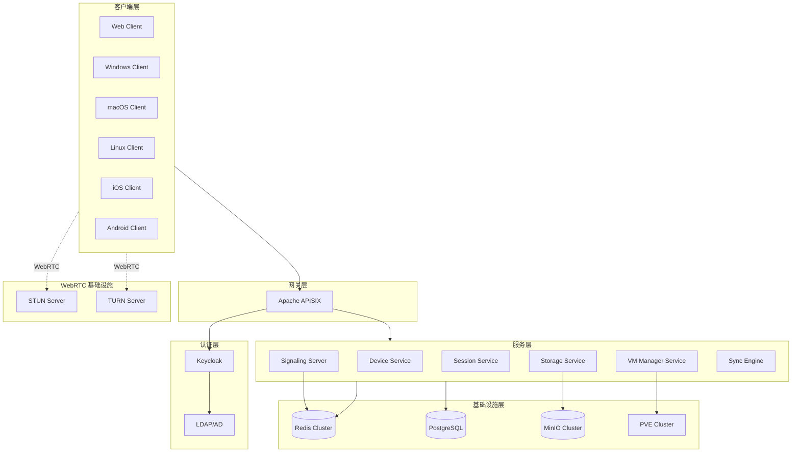
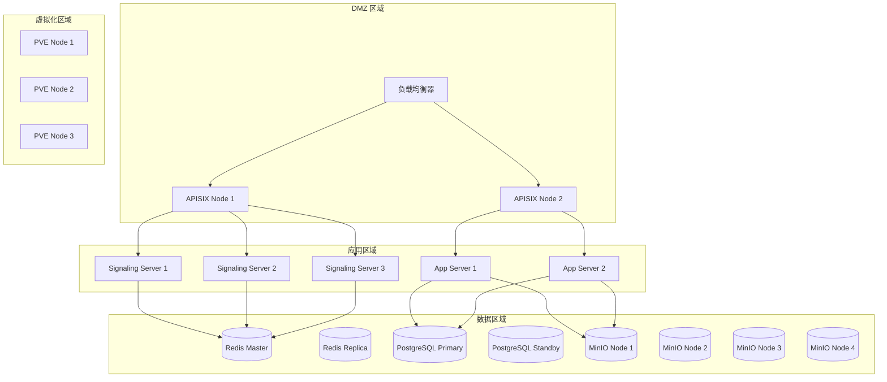

# 设计文档 - 工一云 (CEC - Civil Engineering Cloud)

## 概述

工一云 (CEC) 是一个统一的云工作空间平台，采用现代化的分布式架构设计。系统核心基于 WebRTC 技术实现低延迟远程桌面控制，通过 MinIO 提供高性能云存储服务，使用 Keycloak 实现统一身份认证，并通过 Apache APISIX 作为 API 网关统一管理所有服务入口。

### 设计目标

1. **统一体验**: 在云终端、云电脑和云存储之间提供一致的用户体验
2. **高性能**: 通过 WebRTC 实现低延迟（<100ms）的远程桌面控制
3. **高可用**: 信令服务器无状态设计，支持水平扩展和故障转移
4. **安全性**: 端到端加密，多因素认证，细粒度访问控制
5. **跨平台**: 支持 Windows、macOS、Linux、iOS、Android 和 Web 浏览器

### 技术选型

| 组件 | 技术选型 | 说明 |
|------|----------|------|
| 远程桌面协议 | WebRTC | 低延迟、P2P、浏览器原生支持 |
| 信令服务 | WebSocket + Redis | 实时通信、状态共享 |
| 身份认证 | Keycloak + OIDC | 企业级 SSO、MFA 支持 |
| API 网关 | Apache APISIX | 高性能、插件丰富 |
| 云存储 | MinIO | S3 兼容、高性能对象存储 |
| 虚拟化平台 | Proxmox VE | 开源、功能完整 |
| 前端框架 | React (Web) / Flutter (Mobile) / Electron (Desktop) | 跨平台 UI |
| 后端框架 | Go | 高性能、并发支持好 |

## 架构

### 系统架构图



### 连接建立流程

```mermaid
sequenceDiagram
    participant C as Controller
    participant SIG as Signaling Server
    participant STUN as STUN Server
    participant TURN as TURN Server
    participant T as Controlled

    C->>SIG: 1. 连接请求 (target_device_id)
    SIG->>T: 2. 转发连接请求
    T->>SIG: 3. 接受/拒绝
    SIG->>C: 4. 响应结果
    
    Note over C,T: ICE 候选收集
    C->>STUN: 5. 获取公网地址 (IPv6 优先)
    T->>STUN: 5. 获取公网地址 (IPv6 优先)
    
    C->>SIG: 6. SDP Offer
    SIG->>T: 7. 转发 SDP Offer
    T->>SIG: 8. SDP Answer
    SIG->>C: 9. 转发 SDP Answer
    
    C->>SIG: 10. ICE Candidates
    SIG->>T: 11. 转发 ICE Candidates
    T->>SIG: 12. ICE Candidates
    SIG->>C: 13. 转发 ICE Candidates
    
    Note over C,T: 尝试直连
    C-->>T: 14. P2P 连接尝试
    
    alt 直连成功
        C<-->T: WebRTC P2P 连接
    else 直连失败
        C->>TURN: 15. 中继请求
        T->>TURN: 15. 中继请求
        C<-->TURN: WebRTC 中继连接
        TURN<-->T: WebRTC 中继连接
    end
```

### 部署架构



## 组件和接口

### 1. 信令服务器 (Signaling Server)

负责 WebRTC 连接建立过程中的信令交换。

```go
// SignalingService 信令服务接口
type SignalingService interface {
    // 设备注册
    RegisterDevice(ctx context.Context, req *RegisterDeviceRequest) (*RegisterDeviceResponse, error)
    
    // 设备心跳
    Heartbeat(ctx context.Context, deviceID string) error
    
    // 获取设备状态
    GetDeviceStatus(ctx context.Context, deviceID string) (*DeviceStatus, error)
    
    // 发起连接请求
    RequestConnection(ctx context.Context, req *ConnectionRequest) (*ConnectionResponse, error)
    
    // 响应连接请求
    RespondConnection(ctx context.Context, req *ConnectionResponseRequest) error
    
    // 交换 SDP
    ExchangeSDP(ctx context.Context, req *SDPExchangeRequest) error
    
    // 交换 ICE Candidate
    ExchangeICECandidate(ctx context.Context, req *ICECandidateRequest) error
}

// WebSocket 消息类型
type MessageType string

const (
    MsgTypeRegister        MessageType = "register"
    MsgTypeHeartbeat       MessageType = "heartbeat"
    MsgTypeConnectionReq   MessageType = "connection_request"
    MsgTypeConnectionResp  MessageType = "connection_response"
    MsgTypeSDPOffer        MessageType = "sdp_offer"
    MsgTypeSDPAnswer       MessageType = "sdp_answer"
    MsgTypeICECandidate    MessageType = "ice_candidate"
    MsgTypeDisconnect      MessageType = "disconnect"
)

// WebSocket 消息结构
type WSMessage struct {
    Type      MessageType     `json:"type"`
    RequestID string          `json:"request_id"`
    Payload   json.RawMessage `json:"payload"`
    Timestamp int64           `json:"timestamp"`
}
```

### 2. 设备服务 (Device Service)

管理设备注册、认证和状态。

```go
// DeviceService 设备服务接口
type DeviceService interface {
    // 注册设备
    RegisterDevice(ctx context.Context, req *DeviceRegistration) (*Device, error)
    
    // 获取设备信息
    GetDevice(ctx context.Context, deviceID string) (*Device, error)
    
    // 列出用户设备
    ListUserDevices(ctx context.Context, userID string, filter *DeviceFilter) ([]*Device, error)
    
    // 更新设备信息
    UpdateDevice(ctx context.Context, deviceID string, update *DeviceUpdate) (*Device, error)
    
    // 删除设备
    DeleteDevice(ctx context.Context, deviceID string) error
    
    // 生成访问码
    GenerateAccessCode(ctx context.Context, deviceID string) (*AccessCode, error)
    
    // 验证访问码
    ValidateAccessCode(ctx context.Context, code string) (*Device, error)
    
    // 绑定设备到用户
    BindDeviceToUser(ctx context.Context, deviceID, userID string) error
}

// DeviceType 设备类型
type DeviceType string

const (
    DeviceTypeCloudTerminal DeviceType = "cloud_terminal"  // 云终端（物理PC）
    DeviceTypeCloudComputer DeviceType = "cloud_computer"  // 云电脑（PVE VM）
)
```

### 3. 会话服务 (Session Service)

管理远程控制会话的生命周期。

```go
// SessionService 会话服务接口
type SessionService interface {
    // 创建会话
    CreateSession(ctx context.Context, req *CreateSessionRequest) (*Session, error)
    
    // 获取会话
    GetSession(ctx context.Context, sessionID string) (*Session, error)
    
    // 列出活动会话
    ListActiveSessions(ctx context.Context, userID string) ([]*Session, error)
    
    // 更新会话状态
    UpdateSessionStatus(ctx context.Context, sessionID string, status SessionStatus) error
    
    // 结束会话
    EndSession(ctx context.Context, sessionID string, reason string) error
    
    // 获取会话历史
    GetSessionHistory(ctx context.Context, userID string, filter *SessionFilter) ([]*Session, error)
    
    // 更新会话统计
    UpdateSessionStats(ctx context.Context, sessionID string, stats *SessionStats) error
}

// SessionStatus 会话状态
type SessionStatus string

const (
    SessionStatusPending     SessionStatus = "pending"      // 等待连接
    SessionStatusConnecting  SessionStatus = "connecting"   // 正在连接
    SessionStatusConnected   SessionStatus = "connected"    // 已连接
    SessionStatusDisconnected SessionStatus = "disconnected" // 已断开
)
```

### 4. VM 管理服务 (VM Manager Service)

管理 PVE 虚拟机的生命周期和监控。

```go
// VMManagerService VM 管理服务接口
type VMManagerService interface {
    // 连接 PVE 服务器
    ConnectPVE(ctx context.Context, req *PVEConnectionRequest) (*PVEConnection, error)
    
    // 列出虚拟机
    ListVMs(ctx context.Context, pveID string) ([]*VM, error)
    
    // 获取 VM 详情
    GetVM(ctx context.Context, pveID string, vmID int) (*VMDetail, error)
    
    // 启动 VM
    StartVM(ctx context.Context, pveID string, vmID int) error
    
    // 停止 VM
    StopVM(ctx context.Context, pveID string, vmID int, force bool) error
    
    // 重启 VM
    RestartVM(ctx context.Context, pveID string, vmID int) error
    
    // 暂停 VM
    SuspendVM(ctx context.Context, pveID string, vmID int) error
    
    // 恢复 VM
    ResumeVM(ctx context.Context, pveID string, vmID int) error
    
    // 获取 VM 监控数据
    GetVMMetrics(ctx context.Context, pveID string, vmID int) (*VMMetrics, error)
    
    // 部署远程控制代理
    DeployAgent(ctx context.Context, pveID string, vmID int) error
}

// VMStatus VM 状态
type VMStatus string

const (
    VMStatusRunning VMStatus = "running"
    VMStatusStopped VMStatus = "stopped"
    VMStatusPaused  VMStatus = "paused"
)
```

### 5. 存储服务 (Storage Service)

管理云存储的文件操作。

```go
// StorageService 存储服务接口
type StorageService interface {
    // 列出文件
    ListFiles(ctx context.Context, userID string, path string) ([]*FileInfo, error)
    
    // 获取文件信息
    GetFileInfo(ctx context.Context, userID string, path string) (*FileInfo, error)
    
    // 上传文件（获取预签名 URL）
    GetUploadURL(ctx context.Context, userID string, path string) (*PresignedURL, error)
    
    // 下载文件（获取预签名 URL）
    GetDownloadURL(ctx context.Context, userID string, path string) (*PresignedURL, error)
    
    // 创建文件夹
    CreateFolder(ctx context.Context, userID string, path string) error
    
    // 删除文件/文件夹
    Delete(ctx context.Context, userID string, path string) error
    
    // 移动/重命名
    Move(ctx context.Context, userID string, srcPath, dstPath string) error
    
    // 复制
    Copy(ctx context.Context, userID string, srcPath, dstPath string) error
    
    // 获取版本历史
    GetVersionHistory(ctx context.Context, userID string, path string) ([]*FileVersion, error)
    
    // 恢复版本
    RestoreVersion(ctx context.Context, userID string, path string, versionID string) error
    
    // 创建分享链接
    CreateShareLink(ctx context.Context, userID string, path string, expiry time.Duration) (*ShareLink, error)
    
    // 获取存储使用量
    GetStorageUsage(ctx context.Context, userID string) (*StorageUsage, error)
}
```

### 6. 同步引擎 (Sync Engine)

实现文件增量同步。

```go
// SyncEngine 同步引擎接口
type SyncEngine interface {
    // 初始化同步
    InitSync(ctx context.Context, userID string, localPath string) (*SyncState, error)
    
    // 扫描本地变更
    ScanLocalChanges(ctx context.Context, syncID string) ([]*FileChange, error)
    
    // 扫描远程变更
    ScanRemoteChanges(ctx context.Context, syncID string) ([]*FileChange, error)
    
    // 计算文件差异
    ComputeDelta(ctx context.Context, localFile, remoteFile *FileInfo) (*FileDelta, error)
    
    // 同步文件
    SyncFile(ctx context.Context, syncID string, change *FileChange) error
    
    // 解决冲突
    ResolveConflict(ctx context.Context, syncID string, conflict *Conflict, resolution ConflictResolution) error
    
    // 获取同步状态
    GetSyncStatus(ctx context.Context, syncID string) (*SyncStatus, error)
    
    // 暂停同步
    PausSync(ctx context.Context, syncID string) error
    
    // 恢复同步
    ResumeSync(ctx context.Context, syncID string) error
}

// ConflictResolution 冲突解决策略
type ConflictResolution string

const (
    ConflictResolutionKeepLocal  ConflictResolution = "keep_local"
    ConflictResolutionKeepRemote ConflictResolution = "keep_remote"
    ConflictResolutionKeepBoth   ConflictResolution = "keep_both"
)
```

### 7. WebRTC 引擎 (WebRTC Engine)

封装 WebRTC 功能，提供统一的接口。

```go
// WebRTCEngine WebRTC 引擎接口
type WebRTCEngine interface {
    // 创建 PeerConnection
    CreatePeerConnection(ctx context.Context, config *RTCConfig) (*PeerConnection, error)
    
    // 创建 Offer
    CreateOffer(ctx context.Context, pc *PeerConnection) (*SessionDescription, error)
    
    // 创建 Answer
    CreateAnswer(ctx context.Context, pc *PeerConnection) (*SessionDescription, error)
    
    // 设置本地描述
    SetLocalDescription(ctx context.Context, pc *PeerConnection, sdp *SessionDescription) error
    
    // 设置远程描述
    SetRemoteDescription(ctx context.Context, pc *PeerConnection, sdp *SessionDescription) error
    
    // 添加 ICE Candidate
    AddICECandidate(ctx context.Context, pc *PeerConnection, candidate *ICECandidate) error
    
    // 创建数据通道
    CreateDataChannel(ctx context.Context, pc *PeerConnection, label string) (*DataChannel, error)
    
    // 添加媒体轨道
    AddTrack(ctx context.Context, pc *PeerConnection, track *MediaTrack) error
    
    // 获取连接统计
    GetStats(ctx context.Context, pc *PeerConnection) (*RTCStats, error)
    
    // 关闭连接
    Close(ctx context.Context, pc *PeerConnection) error
}

// RTCConfig WebRTC 配置
type RTCConfig struct {
    ICEServers      []ICEServer `json:"ice_servers"`
    ICETransportPolicy string   `json:"ice_transport_policy"` // "all" or "relay"
    PreferIPv6      bool        `json:"prefer_ipv6"`
}

// ICEServer ICE 服务器配置
type ICEServer struct {
    URLs       []string `json:"urls"`
    Username   string   `json:"username,omitempty"`
    Credential string   `json:"credential,omitempty"`
}
```


## 数据模型

### 核心实体

```go
// Device 设备
type Device struct {
    ID           string            `json:"id" db:"id"`
    UserID       string            `json:"user_id" db:"user_id"`
    Name         string            `json:"name" db:"name"`
    Type         DeviceType        `json:"type" db:"type"`
    Platform     string            `json:"platform" db:"platform"`     // windows, macos, linux, ios, android, web
    Version      string            `json:"version" db:"version"`       // 客户端版本
    Status       DeviceStatus      `json:"status" db:"status"`
    LastOnline   time.Time         `json:"last_online" db:"last_online"`
    HardwareInfo *HardwareInfo     `json:"hardware_info,omitempty" db:"hardware_info"`
    NetworkInfo  *NetworkInfo      `json:"network_info,omitempty" db:"network_info"`
    Tags         []string          `json:"tags" db:"tags"`
    GroupID      string            `json:"group_id,omitempty" db:"group_id"`
    CreatedAt    time.Time         `json:"created_at" db:"created_at"`
    UpdatedAt    time.Time         `json:"updated_at" db:"updated_at"`
}

// DeviceStatus 设备状态
type DeviceStatus string

const (
    DeviceStatusOnline  DeviceStatus = "online"
    DeviceStatusOffline DeviceStatus = "offline"
    DeviceStatusBusy    DeviceStatus = "busy"  // 正在被控制
)

// HardwareInfo 硬件信息
type HardwareInfo struct {
    CPUModel    string `json:"cpu_model"`
    CPUCores    int    `json:"cpu_cores"`
    MemoryTotal int64  `json:"memory_total"` // bytes
    DiskTotal   int64  `json:"disk_total"`   // bytes
    GPUModel    string `json:"gpu_model,omitempty"`
    Displays    []DisplayInfo `json:"displays"`
}

// DisplayInfo 显示器信息
type DisplayInfo struct {
    ID         int    `json:"id"`
    Name       string `json:"name"`
    Width      int    `json:"width"`
    Height     int    `json:"height"`
    RefreshRate int   `json:"refresh_rate"`
    IsPrimary  bool   `json:"is_primary"`
}

// NetworkInfo 网络信息
type NetworkInfo struct {
    PublicIPv4  string `json:"public_ipv4,omitempty"`
    PublicIPv6  string `json:"public_ipv6,omitempty"`
    LocalIP     string `json:"local_ip"`
    NATType     string `json:"nat_type"` // full_cone, restricted_cone, port_restricted, symmetric
    MACAddress  string `json:"mac_address"`
}

// Session 会话
type Session struct {
    ID              string        `json:"id" db:"id"`
    ControllerID    string        `json:"controller_id" db:"controller_id"`
    ControlledID    string        `json:"controlled_id" db:"controlled_id"`
    Status          SessionStatus `json:"status" db:"status"`
    ConnectionType  string        `json:"connection_type" db:"connection_type"` // direct, relay
    StartTime       time.Time     `json:"start_time" db:"start_time"`
    EndTime         *time.Time    `json:"end_time,omitempty" db:"end_time"`
    DisconnectReason string       `json:"disconnect_reason,omitempty" db:"disconnect_reason"`
    Stats           *SessionStats `json:"stats,omitempty" db:"stats"`
    CreatedAt       time.Time     `json:"created_at" db:"created_at"`
}

// SessionStats 会话统计
type SessionStats struct {
    RTT              int64   `json:"rtt"`               // 往返延迟 (ms)
    PacketLoss       float64 `json:"packet_loss"`       // 丢包率 (%)
    Jitter           int64   `json:"jitter"`            // 抖动 (ms)
    VideoBitrate     int64   `json:"video_bitrate"`     // 视频码率 (bps)
    AudioBitrate     int64   `json:"audio_bitrate"`     // 音频码率 (bps)
    FrameRate        int     `json:"frame_rate"`        // 帧率
    Resolution       string  `json:"resolution"`        // 分辨率
    VideoCodec       string  `json:"video_codec"`       // 视频编解码器
    AudioCodec       string  `json:"audio_codec"`       // 音频编解码器
    BytesSent        int64   `json:"bytes_sent"`        // 发送字节数
    BytesReceived    int64   `json:"bytes_received"`    // 接收字节数
}

// AccessCode 访问码
type AccessCode struct {
    Code      string    `json:"code" db:"code"`
    DeviceID  string    `json:"device_id" db:"device_id"`
    ExpiresAt time.Time `json:"expires_at" db:"expires_at"`
    CreatedAt time.Time `json:"created_at" db:"created_at"`
}

// VM 虚拟机
type VM struct {
    ID          int       `json:"id"`
    PVEID       string    `json:"pve_id"`
    Name        string    `json:"name"`
    Status      VMStatus  `json:"status"`
    OSType      string    `json:"os_type"`      // linux, windows
    CPUCores    int       `json:"cpu_cores"`
    MemoryMB    int       `json:"memory_mb"`
    DiskGB      int       `json:"disk_gb"`
    IPAddress   string    `json:"ip_address,omitempty"`
    AgentStatus string    `json:"agent_status"` // installed, not_installed, unknown
    Uptime      int64     `json:"uptime"`       // seconds
}

// VMMetrics VM 监控指标
type VMMetrics struct {
    VMID        int       `json:"vm_id"`
    Timestamp   time.Time `json:"timestamp"`
    CPUUsage    float64   `json:"cpu_usage"`     // 0-100
    MemoryUsage float64   `json:"memory_usage"`  // 0-100
    DiskRead    int64     `json:"disk_read"`     // bytes/s
    DiskWrite   int64     `json:"disk_write"`    // bytes/s
    NetIn       int64     `json:"net_in"`        // bytes/s
    NetOut      int64     `json:"net_out"`       // bytes/s
}

// FileInfo 文件信息
type FileInfo struct {
    Path         string    `json:"path"`
    Name         string    `json:"name"`
    IsDir        bool      `json:"is_dir"`
    Size         int64     `json:"size"`
    ContentType  string    `json:"content_type,omitempty"`
    ModifiedAt   time.Time `json:"modified_at"`
    VersionID    string    `json:"version_id,omitempty"`
    VersionCount int       `json:"version_count,omitempty"`
    Checksum     string    `json:"checksum,omitempty"` // MD5 or SHA256
}

// FileVersion 文件版本
type FileVersion struct {
    VersionID  string    `json:"version_id"`
    Size       int64     `json:"size"`
    ModifiedAt time.Time `json:"modified_at"`
    IsLatest   bool      `json:"is_latest"`
    IsDeleted  bool      `json:"is_deleted"`
}

// ShareLink 分享链接
type ShareLink struct {
    ID        string    `json:"id"`
    UserID    string    `json:"user_id"`
    Path      string    `json:"path"`
    URL       string    `json:"url"`
    Password  string    `json:"password,omitempty"`
    ExpiresAt time.Time `json:"expires_at"`
    Downloads int       `json:"downloads"`
    MaxDownloads int    `json:"max_downloads,omitempty"`
    CreatedAt time.Time `json:"created_at"`
}

// SyncState 同步状态
type SyncState struct {
    ID          string    `json:"id"`
    UserID      string    `json:"user_id"`
    LocalPath   string    `json:"local_path"`
    RemotePath  string    `json:"remote_path"`
    Status      string    `json:"status"` // syncing, paused, error
    LastSync    time.Time `json:"last_sync"`
    PendingChanges int    `json:"pending_changes"`
    Conflicts   int       `json:"conflicts"`
}

// FileDelta 文件差异
type FileDelta struct {
    Path       string       `json:"path"`
    BlockSize  int          `json:"block_size"`
    Blocks     []BlockDelta `json:"blocks"`
    TotalSize  int64        `json:"total_size"`
    DeltaSize  int64        `json:"delta_size"`
}

// BlockDelta 块差异
type BlockDelta struct {
    Index    int    `json:"index"`
    Checksum string `json:"checksum"`
    Data     []byte `json:"data,omitempty"` // 只有变化的块才有数据
    IsNew    bool   `json:"is_new"`
}

// Conflict 同步冲突
type Conflict struct {
    ID          string    `json:"id"`
    SyncID      string    `json:"sync_id"`
    Path        string    `json:"path"`
    LocalInfo   *FileInfo `json:"local_info"`
    RemoteInfo  *FileInfo `json:"remote_info"`
    DetectedAt  time.Time `json:"detected_at"`
}

// User 用户（来自 Keycloak）
type User struct {
    ID            string    `json:"id"`
    Username      string    `json:"username"`
    Email         string    `json:"email"`
    FirstName     string    `json:"first_name"`
    LastName      string    `json:"last_name"`
    Roles         []string  `json:"roles"`
    StorageQuota  int64     `json:"storage_quota"`  // bytes
    StorageUsed   int64     `json:"storage_used"`   // bytes
    MFAEnabled    bool      `json:"mfa_enabled"`
    CreatedAt     time.Time `json:"created_at"`
    LastLoginAt   time.Time `json:"last_login_at"`
}

// PVEConnection PVE 连接配置
type PVEConnection struct {
    ID          string    `json:"id" db:"id"`
    UserID      string    `json:"user_id" db:"user_id"`
    Name        string    `json:"name" db:"name"`
    Host        string    `json:"host" db:"host"`
    Port        int       `json:"port" db:"port"`
    Username    string    `json:"username" db:"username"`
    TokenID     string    `json:"token_id,omitempty" db:"token_id"`
    TokenSecret string    `json:"-" db:"token_secret"` // 加密存储
    Realm       string    `json:"realm" db:"realm"`    // pam, pve, ldap
    Verified    bool      `json:"verified" db:"verified"`
    CreatedAt   time.Time `json:"created_at" db:"created_at"`
    UpdatedAt   time.Time `json:"updated_at" db:"updated_at"`
}
```

### 数据库 Schema

```sql
-- 设备表
CREATE TABLE devices (
    id VARCHAR(36) PRIMARY KEY,
    user_id VARCHAR(36) NOT NULL,
    name VARCHAR(255) NOT NULL,
    type VARCHAR(50) NOT NULL,
    platform VARCHAR(50) NOT NULL,
    version VARCHAR(50),
    status VARCHAR(20) DEFAULT 'offline',
    last_online TIMESTAMP,
    hardware_info JSONB,
    network_info JSONB,
    tags TEXT[],
    group_id VARCHAR(36),
    created_at TIMESTAMP DEFAULT CURRENT_TIMESTAMP,
    updated_at TIMESTAMP DEFAULT CURRENT_TIMESTAMP
);

CREATE INDEX idx_devices_user_id ON devices(user_id);
CREATE INDEX idx_devices_status ON devices(status);

-- 会话表
CREATE TABLE sessions (
    id VARCHAR(36) PRIMARY KEY,
    controller_id VARCHAR(36) NOT NULL REFERENCES devices(id),
    controlled_id VARCHAR(36) NOT NULL REFERENCES devices(id),
    status VARCHAR(20) NOT NULL,
    connection_type VARCHAR(20),
    start_time TIMESTAMP NOT NULL,
    end_time TIMESTAMP,
    disconnect_reason TEXT,
    stats JSONB,
    created_at TIMESTAMP DEFAULT CURRENT_TIMESTAMP
);

CREATE INDEX idx_sessions_controller ON sessions(controller_id);
CREATE INDEX idx_sessions_controlled ON sessions(controlled_id);
CREATE INDEX idx_sessions_status ON sessions(status);
CREATE INDEX idx_sessions_start_time ON sessions(start_time);

-- 访问码表
CREATE TABLE access_codes (
    code VARCHAR(10) PRIMARY KEY,
    device_id VARCHAR(36) NOT NULL REFERENCES devices(id),
    expires_at TIMESTAMP NOT NULL,
    created_at TIMESTAMP DEFAULT CURRENT_TIMESTAMP
);

CREATE INDEX idx_access_codes_device ON access_codes(device_id);
CREATE INDEX idx_access_codes_expires ON access_codes(expires_at);

-- PVE 连接表
CREATE TABLE pve_connections (
    id VARCHAR(36) PRIMARY KEY,
    user_id VARCHAR(36) NOT NULL,
    name VARCHAR(255) NOT NULL,
    host VARCHAR(255) NOT NULL,
    port INT DEFAULT 8006,
    username VARCHAR(255) NOT NULL,
    token_id VARCHAR(255),
    token_secret_encrypted BYTEA,
    realm VARCHAR(50) DEFAULT 'pam',
    verified BOOLEAN DEFAULT FALSE,
    created_at TIMESTAMP DEFAULT CURRENT_TIMESTAMP,
    updated_at TIMESTAMP DEFAULT CURRENT_TIMESTAMP
);

CREATE INDEX idx_pve_connections_user ON pve_connections(user_id);

-- 设备分组表
CREATE TABLE device_groups (
    id VARCHAR(36) PRIMARY KEY,
    user_id VARCHAR(36) NOT NULL,
    name VARCHAR(255) NOT NULL,
    description TEXT,
    created_at TIMESTAMP DEFAULT CURRENT_TIMESTAMP
);

CREATE INDEX idx_device_groups_user ON device_groups(user_id);

-- 分享链接表
CREATE TABLE share_links (
    id VARCHAR(36) PRIMARY KEY,
    user_id VARCHAR(36) NOT NULL,
    path TEXT NOT NULL,
    password_hash VARCHAR(255),
    expires_at TIMESTAMP NOT NULL,
    downloads INT DEFAULT 0,
    max_downloads INT,
    created_at TIMESTAMP DEFAULT CURRENT_TIMESTAMP
);

CREATE INDEX idx_share_links_user ON share_links(user_id);
CREATE INDEX idx_share_links_expires ON share_links(expires_at);

-- 同步状态表
CREATE TABLE sync_states (
    id VARCHAR(36) PRIMARY KEY,
    user_id VARCHAR(36) NOT NULL,
    local_path TEXT NOT NULL,
    remote_path TEXT NOT NULL,
    status VARCHAR(20) DEFAULT 'paused',
    last_sync TIMESTAMP,
    created_at TIMESTAMP DEFAULT CURRENT_TIMESTAMP,
    updated_at TIMESTAMP DEFAULT CURRENT_TIMESTAMP
);

CREATE INDEX idx_sync_states_user ON sync_states(user_id);
```


## 正确性属性

*正确性属性是系统在所有有效执行中都应保持为真的特征或行为——本质上是关于系统应该做什么的形式化陈述。属性作为人类可读规范和机器可验证正确性保证之间的桥梁。*

### Property 1: 设备 ID 唯一性

*对于任意*设备注册请求，系统生成的 Device_ID 必须在整个系统中唯一，不会与任何已存在的设备 ID 冲突。

**Validates: Requirements 4.2, 7.1**

### Property 2: 访问码过期机制

*对于任意*生成的 Access_Code，在生成后 10 分钟内应该有效，超过 10 分钟后应该自动失效，使用过期的访问码进行连接应该被拒绝。

**Validates: Requirements 7.7**

### Property 3: IPv6 优先回退

*对于任意*连接建立请求，系统应该首先尝试 IPv6 连接；如果 IPv6 连接失败，系统应该自动回退到 IPv4 连接，最终连接应该成功建立（假设至少一种协议可用）。

**Validates: Requirements 3.2, 3.3, 3.4**

### Property 4: STUN/TURN 回退机制

*对于任意*连接建立请求，系统应该首先尝试通过 STUN 建立直连；如果直连失败，系统应该自动使用 TURN 服务器进行中继，最终连接应该成功建立。

**Validates: Requirements 5.2, 5.3**

### Property 5: 信令交换完整性

*对于任意*连接请求，信令服务器应该完整转发 SDP offer/answer 和所有 ICE candidates，转发后的消息内容应该与原始消息完全一致。

**Validates: Requirements 4.3**

### Property 6: 信令交换时效性

*对于任意*信令交换过程，从开始到完成的时间应该不超过 5 秒。

**Validates: Requirements 4.5**

### Property 7: 用户 ID 唯一性

*对于任意*用户注册请求，系统生成的用户 ID 必须在整个系统中唯一。

**Validates: Requirements 6.6**

### Property 8: SSO 会话一致性

*对于任意*用户登录操作，登录成功后应该能够访问所有关联服务；登出后，所有关联服务的会话应该同时终止。

**Validates: Requirements 6.3, 6.8**

### Property 9: RBAC 权限控制

*对于任意*用户和资源访问请求，系统应该根据用户的角色正确授予或拒绝访问权限，权限检查结果应该与角色配置一致。

**Validates: Requirements 6.7**

### Property 10: 访问码有效性

*对于任意*有效的 Access_Code，在过期前使用应该能够成功建立连接；同一个访问码不应该被重复使用。

**Validates: Requirements 7.2**

### Property 11: 输入事件延迟

*对于任意*鼠标或键盘输入事件，从 Controller 发送到 Controlled 执行的延迟应该不超过 100ms。

**Validates: Requirements 9.1, 9.2**

### Property 12: 键盘布局正确性

*对于任意*键盘输入事件和键盘布局组合，系统应该正确映射按键到目标系统的对应字符。

**Validates: Requirements 9.5**

### Property 13: 双向文件传输

*对于任意*文件，从 Controller 传输到 Controlled 后再传输回来，文件内容应该与原始文件完全一致（往返一致性）。

**Validates: Requirements 10.1, 10.2**

### Property 14: 断点续传正确性

*对于任意*文件传输，如果传输中断后恢复，最终传输完成的文件应该与原始文件完全一致。

**Validates: Requirements 10.5**

### Property 15: 文件传输加密

*对于任意*文件传输，传输过程中的数据应该是加密的，无法被中间人读取明文内容。

**Validates: Requirements 10.6**

### Property 16: 会话记录完整性

*对于任意*会话，系统应该记录会话的开始时间、结束时间、参与设备和断开原因，记录应该准确反映实际会话状态。

**Validates: Requirements 11.1, 11.2**

### Property 17: 会话历史保留

*对于任意*会话记录，应该在系统中保留至少 30 天，30 天后可以被清理。

**Validates: Requirements 11.5**

### Property 18: 传输加密

*对于任意* WebRTC 媒体流，应该使用 DTLS-SRTP 加密；对于任意信令通信，应该使用 TLS 1.3 加密；对于任意文件传输，应该使用端到端加密。

**Validates: Requirements 12.1, 12.2, 12.3**

### Property 19: 证书验证

*对于任意*连接建立，系统应该验证对端设备的证书，拒绝无效或不受信任的证书。

**Validates: Requirements 12.4**

### Property 20: 密钥轮换

*对于任意*活动会话，会话密钥应该定期轮换，旧密钥应该被安全销毁。

**Validates: Requirements 12.5**

### Property 21: 日志记录完整性

*对于任意*连接建立、断开或错误事件，系统应该记录相应的日志条目，日志应该包含足够的信息用于问题诊断。

**Validates: Requirements 16.1, 16.2**

### Property 22: VM 状态变更

*对于任意* VM 生命周期操作（启动、停止、重启、暂停、恢复），操作应该在 30 秒内完成，操作后 VM 状态应该正确反映操作结果。

**Validates: Requirements 20.1, 20.2, 20.3, 20.4, 20.5, 20.6, 20.7**

### Property 23: S3 API 兼容性

*对于任意* S3 标准 API 调用，MinIO 云存储应该返回与 AWS S3 兼容的响应。

**Validates: Requirements 25.1**

### Property 24: 文件 CRUD 操作

*对于任意*文件或文件夹，创建后应该能够读取、更新和删除；删除后应该不再可访问（除非从回收站恢复）。

**Validates: Requirements 25.4, 25.6**

### Property 25: 文件版本控制

*对于任意*文件上传操作，如果文件已存在，应该创建新版本而非覆盖旧版本；应该能够访问和恢复历史版本。

**Validates: Requirements 26.2, 26.3, 26.4, 26.5**

### Property 26: 分享链接有效性

*对于任意*分享链接，在有效期内应该能够访问共享文件；过期后应该无法访问。

**Validates: Requirements 25.8**

### Property 27: 增量同步正确性

*对于任意*文件变更，同步引擎应该只传输变化的块；同步完成后，本地和远程文件应该完全一致。

**Validates: Requirements 27.2, 27.3, 27.4**

### Property 28: 冲突检测

*对于任意*双向同步场景，当本地和远程同时修改同一文件时，系统应该检测到冲突并正确标记。

**Validates: Requirements 27.6**

### Property 29: 存储加密

*对于任意*存储的文件，应该使用 AES-256 进行服务端加密；传输过程应该使用 TLS 1.3 加密。

**Validates: Requirements 30.1, 30.2, 30.3**

### Property 30: 自适应码率

*对于任意*网络带宽变化，WebRTC 引擎应该自动调整视频码率以适应当前网络条件，避免卡顿或过度缓冲。

**Validates: Requirements 2.6, 8.4**

### Property 31: 帧率范围

*对于任意*远程桌面会话，在网络条件允许的情况下，屏幕传输帧率应该保持在 30-60 FPS 范围内。

**Validates: Requirements 8.3**

### Property 32: 屏幕内容加密

*对于任意*屏幕内容传输，数据应该在传输前加密，确保传输过程中的安全性。

**Validates: Requirements 8.6**

## 错误处理

### 连接错误

| 错误类型 | 错误码 | 处理策略 |
|---------|--------|---------|
| 设备离线 | E1001 | 提示用户设备不在线，建议稍后重试 |
| 连接被拒绝 | E1002 | 提示用户连接请求被对方拒绝 |
| 信令超时 | E1003 | 自动重试 3 次，失败后提示网络问题 |
| ICE 失败 | E1004 | 尝试 TURN 中继，失败后提示 NAT 穿透失败 |
| 认证失败 | E1005 | 提示用户重新登录 |
| 访问码无效 | E1006 | 提示访问码错误或已过期 |
| 会话超时 | E1007 | 自动重连，失败后提示会话已断开 |

### VM 操作错误

| 错误类型 | 错误码 | 处理策略 |
|---------|--------|---------|
| PVE 连接失败 | E2001 | 检查网络和认证信息 |
| VM 不存在 | E2002 | 刷新 VM 列表 |
| 操作超时 | E2003 | 重试操作，提示 PVE 服务器繁忙 |
| 权限不足 | E2004 | 提示用户联系管理员 |
| 资源不足 | E2005 | 提示 PVE 资源不足 |

### 存储错误

| 错误类型 | 错误码 | 处理策略 |
|---------|--------|---------|
| 存储配额超限 | E3001 | 提示用户清理文件或升级配额 |
| 文件不存在 | E3002 | 刷新文件列表 |
| 上传失败 | E3003 | 自动重试，支持断点续传 |
| 下载失败 | E3004 | 自动重试，支持断点续传 |
| 同步冲突 | E3005 | 提示用户选择解决方案 |
| 版本不存在 | E3006 | 刷新版本列表 |

### 错误响应格式

```go
// ErrorResponse 错误响应
type ErrorResponse struct {
    Code      string            `json:"code"`
    Message   string            `json:"message"`
    Details   map[string]string `json:"details,omitempty"`
    Timestamp int64             `json:"timestamp"`
    RequestID string            `json:"request_id"`
}
```

## 测试策略

### 单元测试

- 测试各服务接口的核心逻辑
- 测试数据模型的验证和序列化
- 测试加密和安全相关功能
- 测试错误处理逻辑

### 属性测试

使用 Go 的 `testing/quick` 或 `gopter` 库进行属性测试：

- **Property 1-2**: 测试 ID 生成和访问码过期
- **Property 5**: 测试信令消息转发完整性
- **Property 13-14**: 测试文件传输往返一致性
- **Property 25-27**: 测试版本控制和增量同步

每个属性测试至少运行 100 次迭代。

### 集成测试

- 测试 WebRTC 连接建立流程
- 测试 Keycloak 认证集成
- 测试 PVE API 集成
- 测试 MinIO 存储集成

### 端到端测试

- 测试完整的远程控制流程
- 测试文件传输流程
- 测试 VM 管理流程
- 测试云存储同步流程

### 性能测试

- 测试信令服务器并发处理能力
- 测试文件传输吞吐量
- 测试 WebRTC 连接延迟
- 测试存储服务响应时间

### 安全测试

- 测试加密实现的正确性
- 测试认证和授权机制
- 测试输入验证和防注入
- 测试证书验证逻辑
